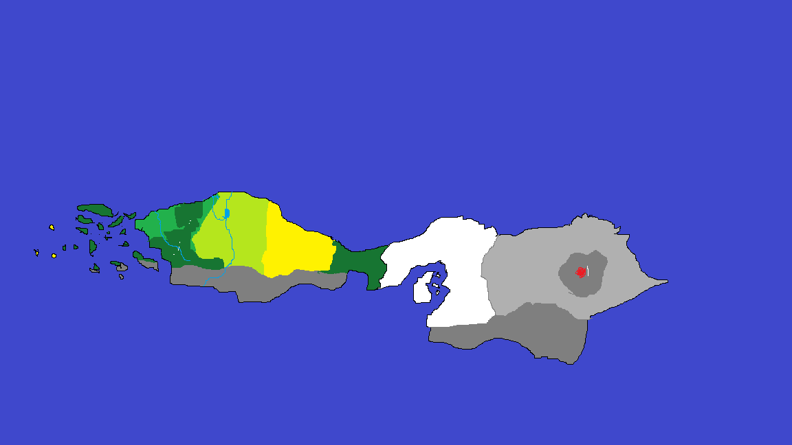

## A pálya

A játékunk 9 szintből fog állni illetve egy kezdő pályarész. A szintek különböző térségekből fog állni. A
szintek között több járható útvonal is lesz.

1. Mezős erdős
1. A Nagy sztyeppe
1. Sivatag
1. A mocsár
1. A föld allati világ
1. A hófödte hegységek
1. A hamu földje
1. A nagy vulkán
1. A Végetnemérők világa

A szintek természetes határai szabják meg a karakter merre tud menni ezek álltalába hegyek vagy a
tenger lesz, de egyrészt nyitott világú lesz a játék. Az egyes szinteknél lesznek hátráltató körülmények:

- **sivatagi forróság:** A játékos túlhevülhet a mozgástól -20% támadási sebesség
- **mocsári láp:** lassítás -20% lassabb mozgási sebesség
- **hó hidegsége:** 3:00 perce múlva -20% sebzés, 6:00 perc múlva folyamatos sebzés ha nincs megfelelő páncélod
- **sötétség:** -50% látótávolság csökkenése

A szintek pontosabb leírása:

### Mezős erdős rész

A játék kezdő szintje, amely egy idilli, zöldellő tájon játszódik. Ezen a szinten a játékos megismerkedik
az alapvető irányítási és harci mechanikákkal, valamint az elsődleges célokkal és feladatokkal.

**Környezet:**

- **Erdők:** Sűrű fák, vastag lombkoronák alatt sétáló utak. Rejtett ösvények és tisztások, ahol gyűjtögetni lehet növényeket és gombákat.

- **Mezők:** Széles, nyitott területek virágokkal és magas fűvel. Itt találkozhatsz vadon élő állatokkal és kisebb ellenségekkel.

- **Patakok és tavak:** Kristálytiszta vizek, amelyek gyógyító hatással bírnak. Bizonyos területeken hidak vagy átkelési pontok.

**Kihívások:**

- **Csapdák:**
  - **Fakötélcsapdák:** Az erdőben rejtett kötelek, melyek ha a játékos rálép, felhúzódnak és csapdába ejtik. A karakter ideiglenesen nem tud mozdulni, és kisebb sebzést szenved.
  - **Ásott gödrök:** Az erdő talajában ásott gödrök, amelyek elrejtve vannak, és ha a játékos beleesik, egy időre lelassítja a mozgást és kárt szenvedhet.
  - **Mérgezett nyilak:** A fák között elhelyezett kis rejtett mechanizmusok, amelyek mérgezett nyilakat lőnek ki, ha a játékos közelébe ér. A találat sebzést és mérgezést okoz.
- **Rejtett kincsek:**
    - Elrejtett ládák és titkos barlangok, amelyekben értékes tárgyakat és bónuszokat találhatunk. Egyes ládák csapdákat rejtenek, amiket ügyesen el kell kerülni.

### A Nagy sztyeppe

Ez a szint egy végtelennek tűnő, kietlen füves pusztaságon játszódik. A sztyeppe nemcsak a nagy távolságok miatt kihívás, hanem a nehéz terepviszonyok miatt is.

**Környezet:**

- **Széles mezők:** Végtelen füves területek, ahol a látótávolság messzire nyúlik.
- **Dombok és sziklaképződmények:** Taktikai előnyt nyújtanak a harcokban, de el is rejthetnek ellenségeket.
- **Nomád táborok:** Barátságos és ellenséges törzsek táborai, amelyek kereskedési lehetőségeket és kihívásokat kínálnak.

**Kihívások:**

- **Tájékozódás:**
  - A sztyeppe hatalmas, nyílt területek, ahol nincs sok referenciapont. A karakter könnyen eltévedhet a tájban, főleg, ha hosszú ideig ugyanazon az úton halad. A tájékozódást segíthetik a táborok, de azokon kívül gyakran szükség van térképekre vagy tájékozódási képességekre.
- **Víz hiánya:**
  - A sztyeppe területén a vízforrások ritkák, és a karakter hidratáltsága folyamatosan csökken. Ha a vízszint lecsökken, a karakter lassabban mozog, és fokozatosan szenved a hőség okozta sebzést. A víz nélkülözhetetlen, különben a karakter elfárad, és csökken a támadási sebessége, valamint a harci képességei is gyengülnek.

### Sivatag

A játék harmadik szintje a forró, kietlen sivatagban játszódik. Itt a hőség és a homokviharok komoly kihívásokat jelentenek.

**Környezet:**

- **Homokdűnék:** Végtelen, hullámzó homokdűnék, amelyek nehezítik a mozgást.
- **Oázisok:** Ritka, életmentő területek, ahol vízhez és árnyékhoz lehet jutni.
- **Romok:** Elfeledett, ősi városok maradványai, amelyek kincseket és ellenségeket rejtenek.

**Kihívások:**

- **Forróság:**
  - A karakter a sivatagi hőségben könnyen túlhevülhet a mozgás és a harc közben. Amikor a karakter túl hosszú ideig tartózkodik a forró területeken, csökken a támadási sebessége (-20%), és a mozgás is lassul. Ha nem talál árnyékot vagy oázist, a hőség fokozódik, és az elfogyott víz miatt a karakter fokozott sebzést szenvedhet.
- **Homokviharok:**
  - A sivatagi homokviharok elrejtik a karaktert a látóteréből, csökkentve a látótávolságot. A homokviharok nemcsak a navigálást nehezítik meg, hanem folyamatosan apró sebzést is okoznak, mivel a karaktert homok és éles szikrák érik. Ezek az időszakos viharok a karakter mozgási sebességét is lelassíthatják, és megnehezíthetik a harcot.

### A mocsár
Ez a szint egy sötét, nedves és veszélyekkel teli mocsárvidéken játszódik. Itt a mozgás lassabb és a látótávolság korlátozott.

Környezet:

- **Lápos területek:** Mély, sáros részek, ahol a karakter mozgása lelassul.
- **Mocsári fák:** Hatalmas, gótikus fák, amelyek elrejtik az ösvényeket.
- **Rejtett tavak:** Mérgező vízű tavak, amelyek közelében veszélyes lények élnek.

**Kihívások:**

- **Lassítás:**
  - A mocsárban való mozgás rendkívül lassú, mivel a talaj sáros és ragadós. A karakter mozgása -20%-kal lelassul, így nehezebb gyorsan reagálni a támadásokra vagy elkerülni az ellenségeket. A mocsár növényzete, valamint a víz alatti területek tovább lassítják a karaktert.

- **Mérgezés:**
  - Bizonyos mocsári területeken mérgező gázok és toxinok szabadulnak fel a talajból. Ha a karakter hosszabb ideig tartózkodik ezeken a helyeken, folyamatos sebzést szenved, és mérgezési tünetek jelentkeznek, mint például a fokozódó életpontcsökkenés. A mérgezés akkor is bekövetkezhet, ha a játékos nem figyel a környezetére, és belelép egy mérgezett növénybe vagy vízbe.

### A föld alatti világ

A föld alatti világ egy sötét, komor helyszín, ahol a mélység és a sötétség uralkodik. A szint tele van barlangokkal, alagutakkal és föld alatti folyókkal.

**Környezet:**

- **Barlangok:** Kanyargós járatok, amelyek tele vannak éles sziklákkal és szűk folyosókkal.
- **Alagutak:** Hosszú, sötét alagutak, amelyek néha összeomolhatnak vagy zsákutcába vezetnek.
- **Föld alatti folyók:** Mély, lassan folyó vizek, amelyek átszelik a barlangokat.

**Kihívások:**

- **Sötétség:**
  - A föld alatti világ szinte teljesen sötét, ami jelentősen csökkenti a látótávolságot. A karakter látótávolsága -50%-kal csökken, ami megnehezíti a navigálást és az ellenségek észlelését. A játékosnak szüksége lesz lámpákra, fáklyákra vagy varázslatokra a megfelelő világításhoz, különben a csapdák és ellenségek könnyen meglephetik.
- **Navigáció:**
  - A föld alatti barlangok és alagutak szűkek és könnyen eltévedhetünk bennük. A labirintusokban való tájékozódás nagyon fontos, mivel a szűk folyosók és a különböző szintkülönbségek miatt könnyen zsákutcába juthatunk. A szint különleges térképeket, iránytűket vagy jelzéseket tartalmaz, amelyek segíthetnek a helyes irány megtalálásában.

### A hófödte hegységek

Ez a szint egy fagyos, jeges területen játszódik, ahol a hideg az egyik legnagyobb ellenség.

**Környezet:**

- **Hegyek:** Magas, havas csúcsok és meredek lejtők, ahol a mozgás nehézkes és veszélyes lehet.
- **Jeges utak:** Csúszós felületek, ahol könnyen eleshetünk.
- **Hóviharok:** Időnkénti hóviharok, amelyek korlátozzák a látótávolságot és nehezítik a mozgást.

**Kihívások:**

- **Hidegség:**
  - A hófödte hegységekben az alacsony hőmérséklet komoly hatással van a karakterre. 3:00 perc elteltével a karakter -20%-kal csökkent támadási sebességgel képes támadni, és 6:00 perc után, ha nincs megfelelő páncélja, folyamatos -2% sebzés hatással lesz a karakterre a fagyás miatt. Az ilyen hatások elkerülésére meleg ruházat vagy páncél szükséges, különben folyamatosan veszíthetünk életpontokat a fagyás következtében.
- **Csúszós felületek:**
  - A hó és jég borította területeken különösen veszélyes a mozgás. A karakter könnyen megcsúszhat, ha nem ügyel a lépéseire, ez pedig lassítja a mozgást és eséshez vezethet. A csúszós felületeken való gyors közlekedéshez a játékosnak ügyesnek kell lennie a mozgás irányításában, hogy elkerülje a zuhanásokat.

### A hamu földje

Ez a szint egy poszt-apokaliptikus, hamuval borított tájon játszódik, ahol minden élettelen és kietlen.

**Környezet:**

- **Hamuföld:** Szürke, poros területek, ahol a látótávolság korlátozott.
- **Elhagyatott falvak:** Elpusztult, romos épületek és házak, amelyek rejtekhelyeket kínálnak.•
- **zétszórt törmelék:** Az egykori civilizáció maradványai, amelyek akadályokat képeznek.

**Kihívások:**

- **Navigáció:**
  - A hamuval borított táj teljesen lecsökkenti a látótávolságot. A táj egyhangú, szürke, és könnyen eltévedhetünk a romok között. A karakter egyre inkább elvesztheti az irányítást, ha nem használja figyelmesen a környezetét. Az iránytűk és a ritka tájékozódási pontok segíthetnek, de a szint elég nagy ahhoz, hogy könnyen elveszítsük az irányt.
- **Látótávolság:**
  - A hamu és por folyamatosan akadályozza a látást. A látótávolság jelentősen csökken, és a játékosnak minden lépését meg kell fontolnia. Az ellenségek is könnyen elbújhatnak a sűrű porban, így gyakran a közelharc válik a legnagyobb kihívássá, mivel nem látni jól a távolságot.

### A nagy vulkán

Ez a szint egy aktív vulkán körül játszódik, ahol a hőség és a láva jelenti a legnagyobb veszélyt.

**Környezet:**

- **Lávafolyamok:** Folyékony láva patakok, amelyeket át kell ugrani vagy kerülni.
- **Vulkáni sziklák:** Instabil, forró sziklák, amelyek bármikor összeomolhatnak.
- **Füst és gáz:** Mérgező gázok és füstfelhők, amelyek időnként ellephetik a területet.

**Kihívások:**

- **Hőség:**
  - A vulkán környékén a hőmérséklet extrém magas, és a karakter túlhevülhet a harc és a mozgás következtében. A karakter mozgása lelassul, -20%-kal csökken a támadási sebesség és a mozgás sebessége a hőség hatására. Ha a karakter túl sokáig tartózkodik a lávák közelében, akár folyamatos életpont veszteséget is elszenvedhet.
- **Instabil terep:**
  - A vulkán körüli terület instabil, a forró lávafolyamok és sziklák könnyen összeomolhatnak vagy elmozdulhatnak. A játékosnak folyamatosan figyelnie kell, hogy mely sziklák stabilak, mert ha nem, a láva eláraszthatja a karaktert vagy akár egy veszélyes területre sodorhatja. A talaj repedései és forró pontjai minden pillanatban nagy kockázatot jelentenek.

### A Végetnemérők világa

Ez a szint egy misztikus, másvilági tájon játszódik, ahol a valóság határai elmosódnak.

**Környezet:**

- **Lebegő szigetek:** Különálló, lebegő területek, amelyeket hidak vagy varázslatos ösvények kötnek össze.
- **Dimenziókapuk:** Misztikus portálok, amelyek egyik helyről a másikra vezetnek.
- **Furcsa tájak:** Földöntúli növényzet és kristályok, amelyek különleges fényben tündökölnek.

**Kihívások:**

- **Navigáció:**
  - A Végetnemérők világa egy misztikus hely, ahol a valóság határvonalai elmosódnak. A területen lebegő szigetek, dimenziókapuk és különféle torzulások nehezítik a navigációt. A karakter könnyen eltévedhet, és a portálok, amelyek egyik helyről a másikra vezetnek, zűrzavart okozhatnak. A szigeteken való ugrálás vagy az áramlások követése miatt gyakran a karakternek döntéseket kell hoznia, hogy melyik irányba haladjon.
- **Valóság torzulása:**
  - A valóság torzulásai miatt a világ időnként nem követi a megszokott törvényeit. A karakter mozgásának sebessége változhat, és egyes területeken az idő dilatálódhat, vagy a gravitáció megváltozhat. A torzult valóságban könnyen megzavarodhatunk, ha nem figyelünk, és akár egy-egy portál vagy dimenziókapu is váratlan veszélyeket hozhat.
