## Támadás és sebzés mechanika

### Játékos Statok

Minden játékos az alábbi statok-kal rendelgezik:

-   **Strength:** Erő. Meghatározza, hogy mennyi a maximum HP értéke. A
    fizikai eredetű támadásokat erősíti.

-   **Inteligence:** Inteligencia. Meghatározza, hogy mennyi a maximum
    SP. Mágikus támadás erejét erősíti.

-   **Faith:** Hit.

    -   **Spiritual Strength:** Spirituális erő. Maximum manna értéke.

    -   **Determination:** Elhivatotság. Minél nagyobb, annál gyorsabban
        gyógyul a Manna és SP.

-   **Speed:**

    -   **Movement Speed:** Mozgási Sebesség. Minél nagyobb, annál
        gyorsabb.

    -   **Attack Speed:** Támadási Sebesség. Minél nagyobb, anál
        kevesebb idő telik el két támadás között.

Csak a listában nem alárendelt elemeket (Strength, Inteligence, Faith,
Speed) lehet közvetlen fejleszteni. Az alárendeltek értéke alapból
ugyanaz, mint a szülőjüké. Viszont különleges képességnek lehet hatása
csak alárendeltre.

### Sebzés Típusok

Minden fegyver az alábbi tulajdonságokkal rendelkezik.

-   **Érték:** Két integer, $a$ és $b$. $0 \leq a \leq b$. A fegyver
    alap sebzése támadásonként egy random lebegőpontos szám $a$ és $b$
    között (inklúzív).

-   **Eredet:** Hogy miből ered a támadás, ezek az alábbiak lehetnek:

    -   **Fizikai:** A fegyver általi támadás a fizika törvényei alapján
        megmegyarázható. pl. kard, nyíl, etc.

    -   **Mágikus:** A fegyver mágikus úton viszi véghez a támadást.

-   **Típus:** Hogy milyen maga a támadás, amit a fegyver csinál.

    -   **Standart:** Ezek a "normális" támadások, az esetek \~95%-ában
        ilyenek lesznek

        -   **Fizikai (A):** A fegyver fizikai kárt okoz. HP csökken fix
            értékkel.

        -   **Mentális (B):** A fegyver mentális kárt okoz. SP csökken
            fix értékkel.

        -   **Kombinált (C):** A fegyver fizika és mentális kárt okoz.
            HP és SP csökken fix értékkel.

        -   **Százalékos (D):** A fegyver fizikai kárt okoz. HP a MAX HP
            értékéhez vett aránnyal csökken.

    -   **Speciális:** Vagy ritka, vagy csak technikai okok miatt létező
        támadás típus.

        -   **Multiplex:** Egy (valószínűség, sebzés) páros, ahol a
            sebzés Standart. Támadáskor random dől el, hogy melyik lesz.

        -   **Esoteric:** A sebzésnek egyedi effektja van, amit mással
            nem lehet leírni.

-   **PushBack:** Egy 32 bites lebegőpontos szám, ami megmondja a
    találat hátralökés értékét.

-   **Manna Cost:** Mágikus eredetű támadás esetén mennyi Manna pontot
    von le.

### Sebzés számítása

-   **Standart**

    -   **A, B, C:**
        $(A + S) \cdot L \cdot E_{t} \cdot E_{o} \cdot E_{s}$

    -   **D:** $M \cdot 0.01 \cdot A \cdot L \cdot E_{t} \cdot E_{s}$

    -   Ahol:

        -   $A ≔$ A fegyver alap támadási ereje. $A \geq 0$

        -   $S ≔ x/15$, ahol $x$ a támadás eredetétől függően a Strength
            vagy Inteligence értéke.

        -   $L ≔$ Támodó fegyvere és támadott páncélja közötti
            szintkülönbség alapján megállapított konstans. $- 4$ és $4$
            között rendre
            $\left\{ 0.4,0.6,0.7,0.8,1,1,1.2,1.5,2 \right\}$

        -   $E_{t} ≔$ A támadott páncélja ("enemy armor type") védelme
            az adott támadás típusától függően.
            $- 1 \leq E_{t} \leq 2.0$

        -   $E_{o} ≔$ A támadott páncélja ("enemy armor origin") védelme
            az adott támadás eredetétől függően. $0 \leq E_{o} \leq 2.0$

        -   $E_{s} ≔$ A támadott pajzsa ("enemy shield") védelme az
            adott támadás típusától függően, ha éppen felfogja a
            támadást, különben $1$. $E_{s} \in \left\{ 0.5,1 \right\}$

        -   $M ≔$ Ha a támadott a játékos lovagja, akkor annak a MAX HP
            értéke, különben $100$.

    -   **Speciális:**

        -   **Multiplex:** A kiválasztott támadás eredménye.

        -   **Esoteric:** Bármi.

### Sebzés megjeleítése UI-ban

-   **Standart:** Megjelenik a Standart sebzéshez tartozó ikon.

-   **Multiplex:** Azon Standart ikonok "egyben", amiken nem 0 a
    valószínüsége.

-   **Esoteric:** Bármi.

### Fegyvertár

<a href="weapon-06.svg" target="_blank">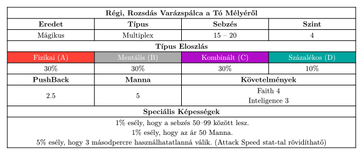</a>

<a href="weapon-16.svg" target="_blank">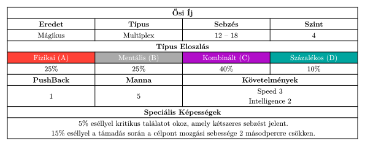</a>

<a href="weapon-26.svg" target="_blank">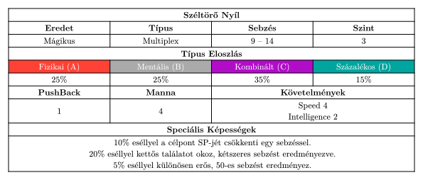</a>

### Páncélok

<a href="armor-01.svg" target="_blank">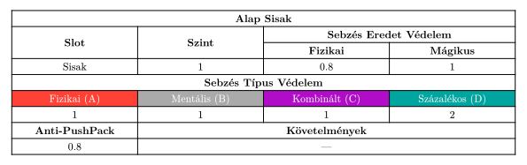</a>

<a href="armor-02.svg" target="_blank">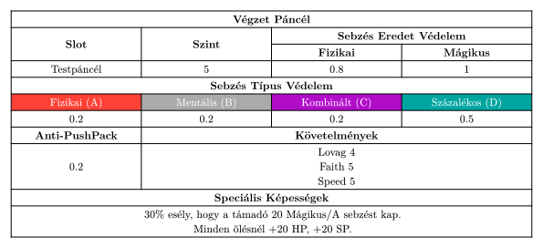</a>

<a href="armor-03.svg" target="_blank">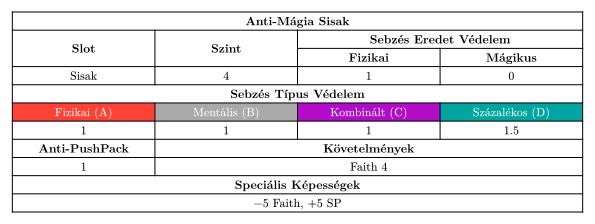</a>

<a href="armor-11.svg" target="_blank">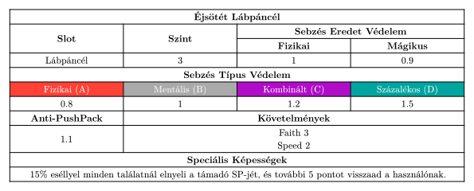</a>

<a href="armor-13.svg" target="_blank">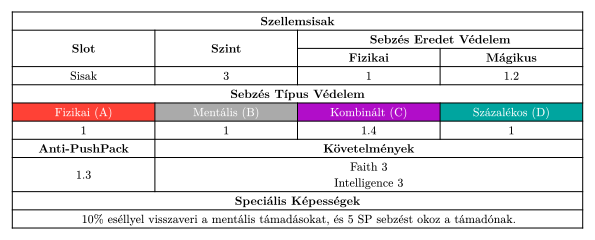</a>

<a href="armor-14.svg" target="_blank">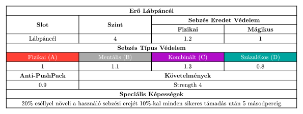</a>

<a href="armor-15.svg" target="_blank">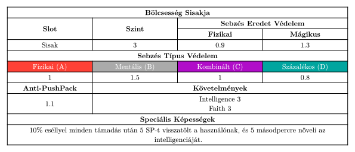</a>

<a href="armor-21.svg" target="_blank">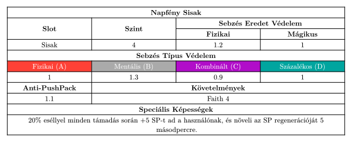</a>

