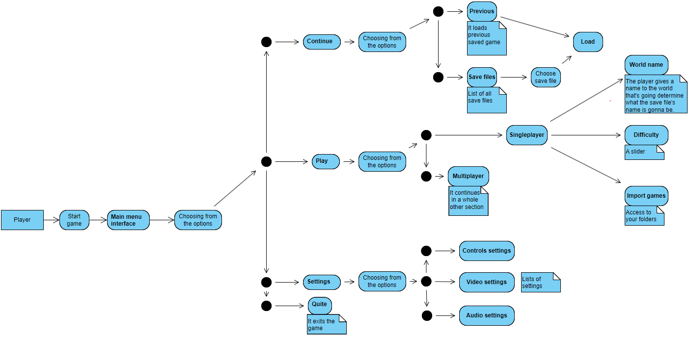
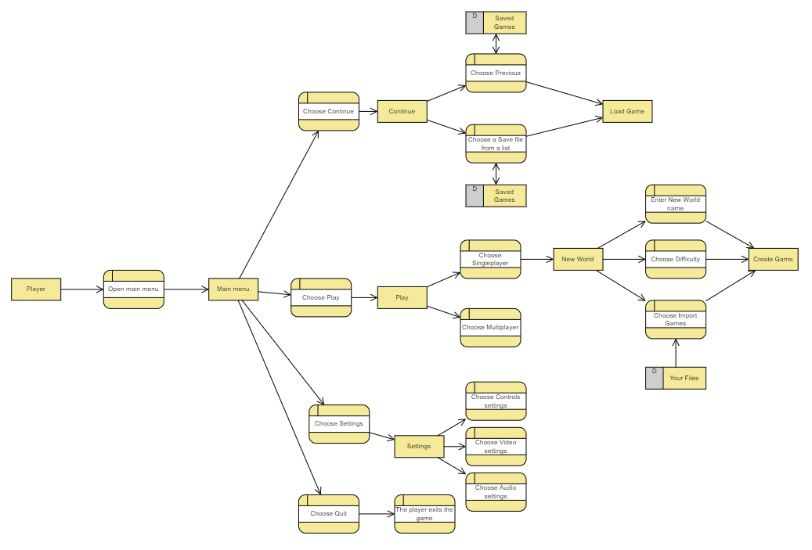
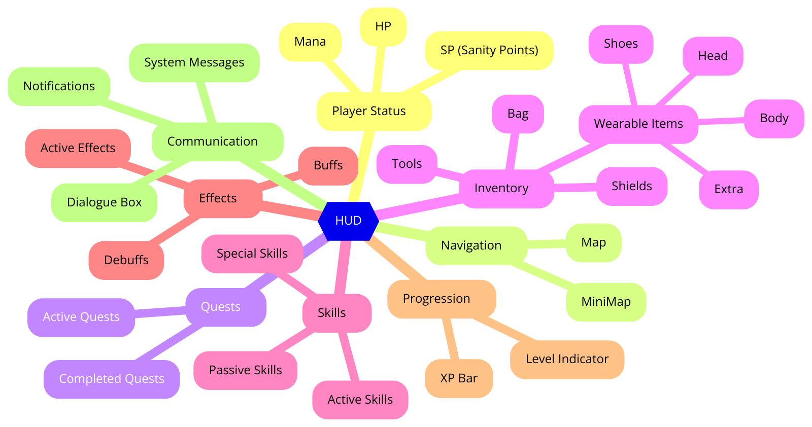
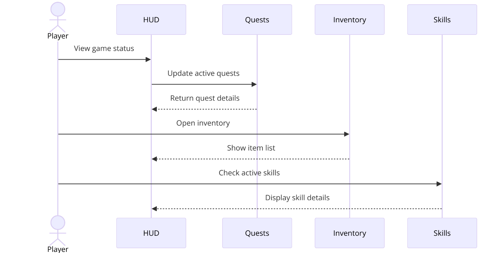
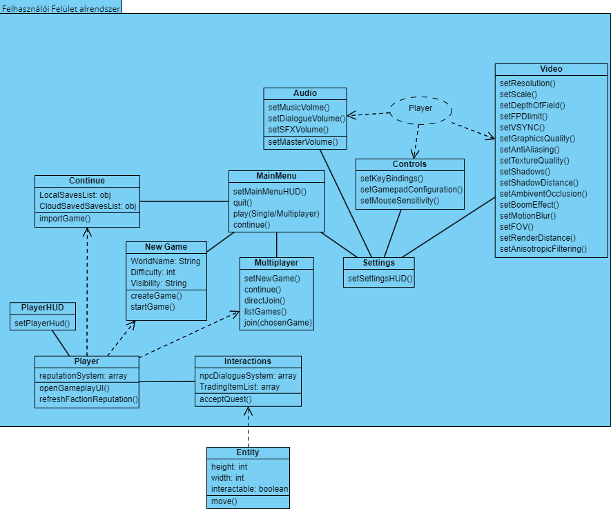

# Felhasználói felület alrendszer modellje

## Statikus modell

### Kapcsolatok pontosítása

### Osztályok a felhasználói felület alrendszerében

- **MainMenu:** Az összefűző osztály, amely kezeli a főmenü elemeit, és innen érhetjük el a többi osztály funkcióit. Ezekkel az osztályokkal áll kapcsolatban:
  - **NewGame:** Hívásakor új játékot hozunk létre, amelyhez kettő dolog megadása szükséges: a világ neve, és hogy milyen nehézségi szintű legye a játék. Ezt elmenthetjük és folytathatjuk.
  - **LoadGame:** Az elmentett játékok betöltése.
  - **Settings:** A játék beállításainak kezelése, mint videó, hang és vezérlési beállítások.
  - **Quit:** A játék bezárása.

- **Settings:** Az osztály, amely kezeli a különböző beállításokat és azok mentését. Kapcsolatban áll a következő osztályokkal:
  - **VideoSettings:** A videó beállítások kezelése. Különböző csúszkák illetve mini listákból áll.
  - **AudioSettings:** A hang beállítások kezelése csúszkákkal.
  - **ControlSettings:** A vezérlési beállítások kezelése, billentyűk funkcióinak beállítása.

- **HUD:** A játékos állapotának megjelenítése, beleértve az életerőt, manát, SP-t (Sanity Points), valamint a minitérképet, küldetéseket, inventory-t és egyéb információkat.

- **HUDOnline (Only Online Elements):** Csak online játékhoz kapcsolódó elemek.

### Attribútumok azonosítása

Az alábbi releváns attribútumokat rendeljük hozzá az alrendszer osztályaihoz:

**MainMenu (Főmenü):**
- **NewGame:** tartalmazhat olyan attribútumokat, mint a `gameName`, `maxPlayers`, `gameMode`, `gameDifficulty`, `gameVisibility` (Csatlakozhatnak-e hozzá ez opcionális vagyis a Singleplayer-ben elengedhető).

<table>
  <thead>
    <tr>
      <th>Settings</th>
      <th>Attribútum</th>
      <th>Leírás</th>
    </tr>
  </thead>
  <tbody>
    <tr>
      <td>`VideoSettings`</td>
      <td>`resolution`</td>
      <td>A képernyőfelbontás beállítása1920x1080 (Full HD), 2560x1440 (QHD), 3840x2160 (4K), Windowed / Fullscreen / Borderless</td>
    </tr>
    <tr>
      <td></td>
      <td>`scale`</td>
      <td>Scale beállítás: 100% / 125% / 150%</td>
    </tr>
    <tr>
      <td></td>
      <td>`fpsLimit`</td>
      <td>FPS korlátozás: 30 / 60 / 120 / 144 / Uncapped</td>
    </tr>
    <tr>
      <td></td>
      <td>`vSync`</td>
      <td>V-Sync beállítás: On / Off</td>
    </tr>
    <tr>
      <td></td>
      <td>`graphicsQuality`</td>
      <td>Grafikai minőség: Low / Medium / High / Ultra</td>
    </tr>
    <tr>
      <td></td>
      <td>`antiAliasing`</td>
      <td>Élsimítás: Off / FXAA / MSAA / TAA</td>
    </tr>
    <tr>
      <td></td>
      <td>`textureQuality`</td>
      <td>Textúra minőség: Low / Medium / High / Ultra</td>
    </tr>
    <tr>
      <td></td>
      <td>`shadows`</td>
      <td>Árnyékok: Off / Low / Medium / High</td>
    </tr>
    <tr>
      <td></td>
      <td>`shadowDistance`</td>
      <td>Árnyék távolság: Near / Medium / Far</td>
    </tr>
    <tr>
      <td></td>
      <td>`ambientOcclusion`</td>
      <td>Környezeti takarás: On / Off</td>
    </tr>
    <tr>
      <td></td>
      <td>`bloomEffect`</td>
      <td>Bloom effekt: On / Off</td>
    </tr>
    <tr>
      <td></td>
      <td>`motionBlur`</td>
      <td>Mozgási elmosódás: Off / Low / Medium / High</td>
    </tr>
    <tr>
      <td></td>
      <td>`fieldOfView`</td>
      <td>Látószög (FOV): 60° / 75° / 90° / 100° / 110°</td>
    </tr>
    <tr>
      <td></td>
      <td>`depthOfField`</td>
      <td>Mélységélesség: On / Off</td>
    </tr>
    <tr>
      <td></td>
      <td>`renderDistance`</td>
      <td>Renderelési távolság: Near / Medium / Far</td>
    </tr>
    <tr>
      <td></td>
      <td>`anisotropicFiltering`</td>
      <td>Anizotróp szűrés: Off / 2x / 4x / 8x / 16x</td>
    </tr>
    <tr>
      <td></td>
      <td>`colorBlindMode`</td>
      <td>Színtévesztő mód: On / Off</td>
    </tr>
    <tr>
      <td>`AudioSettings`</td>
      <td>`masterVolume`</td>
      <td>A fő hangerő szintje</td>
    </tr>
    <tr>
      <td></td>
      <td>`musicVolume`</td>
      <td>A zenei hangerő szintje</td>
    </tr>
    <tr>
      <td></td>
      <td>`sfxVolume`</td>
      <td>A hangeffektek hangerő szintje</td>
    </tr>
    <tr>
      <td></td>
      <td>`dialogueVolume`</td>
      <td>A párbeszédek hangerő szintje</td>
    </tr>
    <tr>
      <td>`ControlSettings`</td>
      <td>`keyBindings`</td>
      <td>A billentyűkiosztás konfigurációja</td>
    </tr>
    <tr>
      <td></td>
      <td>`mouseSensitivity`</td>
      <td>Az egér érzékenységének beállítása</td>
    </tr>
    <tr>
      <td></td>
      <td>`gamepadConfiguration`</td>
      <td>Gamepad konfiguráció</td>
    </tr>
  </tbody>
</table>

**HUD:**

- **HP**: A játékos életereje.
- **Mana**: A játékos mana pontjai.
- **SP (Sanity Points)**: A játékos elmeállapota.
- **MiniMap**: A játékos környezetének megjelenítése.
  - **Map**: A teljes térkép.
  - **Quests**: A játékos küldetéseinek nyomon követése.
    - **Active Quests**: Jelenleg aktív küldetések.
    - **Completed Quests**: Teljesített küldetések.
- **Inventory**: A játékos tárgyainak kezelése.
  - **Wearable**: Viselhető tárgyak.
    - **Head**: Fejre viselhető tárgyak.
    - **Body**: Testre viselhető tárgyak.
    - **Shoes**: Lábbeli.
    - **Extra Item**: Kiegészítő tárgyak.
  - **Tool (Weapons Only)**: Fegyverek.
  - **Shield (Defensive Items Only)**: Védekező tárgyak.
  - **Bag (Extra Item Slots)**: További tárhely.
    - **List of Items**: Tárgyak listája.
    - **List of Quest items (infinite slots)**: Küldetési tárgyak listája.
  - **Gold (Currency)**: Pénz.
- **Skills**: A játékos képességei.
  - **Active Skills**: Aktív képességek.
  - **Passive Skills**: Passzív képességek.
  - **Special Skills**: Különleges képességek.
- **Buffs/Debuffs**: A játékosra ható pozitív és negatív hatások.
  - **Active Effects**: Aktív hatások.
  - **XP Bar (Experience Points)**: Tapasztalati pontok sávja.
  - **Level Indicator**: Szintjelző.
  - **Dialogue Box**: Párbeszédek megjelenítése.
- **Notifications**: Értesítések megjelenítése.
  - **System Messages**: Rendszerüzenetek.
  - **Achievements**: Eredmények.

### Bázisosztályok keresése

Azonosított Bázisosztályok

**MenuOption Bázisosztály**

Az osztályokban található cím, opciók és kiválasztottOpció attribútumok alapján
bevezetünk egy közös bázisosztályt:

- **MenuOption**
  - **Attribútumok:**
    - **cím (title):** `String`
    - **opciók (options):** `List`
    - **kiválasztottOpció (selectedOption):** `String`

**SettingsOption Bázisosztály**

Az egyes beállítások osztályaiban ismétlődő attribútumokat egy közös bázisosztályba
emeljük:

- **SettingsOption**
  - **Attribútumok:**
    - **felbontás (resolution):** `List`
    - **scale:** `List`
    - **fpsLimit:** `List`
    - **vSync:** `Boolean`
    - **graphicsQuality:** `List`
    - **antiAliasing:** `List`
    - **textureQuality:** `List`
    - **shadows:** `List`
    - **shadowDistance:** `List`
    - **ambientOcclusion:** `Boolean`
    - **bloomEffect:** `Boolean`
    - **motionBlur:** `List`
    - **fieldOfView:** `List`
    - **depthOfField:** `Boolean`
    - **renderDistance:** `List`
    - **anisotropicFiltering:** `List`
    - **colorBlindMode:** `Boolean`

**VolumeSettings Bázisosztály**

A hangbeállítások osztályában található ismétlődő hangerő attribútumokat egy közös
bázisosztályba emeljük:

- **VolumeSettings**
  - **Attribútumok:**
    - **masterVolume:** `Integer`
    - **musicVolume:** `Integer`
    - **sfxVolume:** `Integer`
    - **dialogueVolume:** `Integer`

**ControlSettings Bázisosztály**

A vezérlés beállításainak attribútumait egy közös bázisosztályba emeljük:

- **ControlSettings**
  - **Attribútumok:**
    - **keyBindings:** `Map`
    - **mouseSensitivity:** `Float`
    - **gamepadConfiguration:** `Map`

## Dinamikus modell

## Funkcionális modell

**Hud diagramm:**

## Operációk azonosítása

## Az analízis modell osztálydiagramja

## Az analízis modell osztályainak listája

### MainMenu

**Felelőssége, feladata**: A főmenü kezelése, innen érhetőek el a játék különböző funkciói.  
**Együttműködők**: `NewGame`, `Continue`, `Settings`, `Multiplayer`

**Attribútumok:**

<table>
  <tr>
    <th>Név</th>
    <th>Típus</th>
    <th>Leírás</th>
  </tr>
  <tr>
    <td>`mouse`</td>
    <td>`Listener`</td>
    <td>Az egér kattintásával való irányítás az opciók között.</td>
  </tr>
</table>

**Operációk:**

<table>
  <tr>
    <th>Név</th>
    <th>Argumentumok</th>
    <th>Működése, feladata</th>
  </tr>
  <tr>
    <td>`setMainMenuHUD()`</td>
    <td>nincs</td>
    <td>A HUD megalkotása és megvalósítása.</td>
  </tr>
  <tr>
    <td>`quit()`</td>
    <td>nincs</td>
    <td>A program befejezése, kilépés.</td>
  </tr>
  <tr>
    <td>`play()`</td>
    <td>nincs</td>
    <td>Játékmód kiválasztása.</td>
  </tr>
  <tr>
    <td>`continue()`</td>
    <td>nincs</td>
    <td>Mentések elérése.</td>
  </tr>
</table>

### Continue

**Felelőssége, feladata**: A legutóbbi és egyéb mentések elérése és betöltése.  
**Együttműködők**: `MainMenu`

**Attribútumok:**

<table>
  <tr>
    <th>Név</th>
    <th>Típus</th>
    <th>Leírás</th>
  </tr>
  <tr>
    <td>`LocalSavesList`</td>
    <td>`obj`</td>
    <td>Mentések elérése.</td>
  </tr>
  <tr>
    <td>`CloudSavedSavesList`</td>
    <td>`obj`</td>
    <td>Mentések elérése a felhőből.</td>
  </tr>
</table>

**Operációk:**

<table>
  <tr>
    <th>Név</th>
    <th>Argumentumok</th>
    <th>Működése, feladata</th>
  </tr>
  <tr>
    <td>`importGame()`</td>
    <td>nincs</td>
    <td>Mentések betöltése.</td>
  </tr>
</table>

### Multiplayer

**Felelőssége, feladata**: A HUD és a multiplayer felület kezelése, emellett itt hívjuk meg a többi osztály függvényeit.  
**Együttműködők**: `New Game`, `Load Game`, `List Games`, `Direct Join`, `MainMenu`

**Attribútumok:**

<table>
  <tr>
    <th>Név</th>
    <th>Típus</th>
    <th>Leírás</th>
  </tr>
  <tr>
    <td>`mouseListener`</td>
    <td>Listener</td>
    <td>Az egér kattintásával való irányítás az opciók között.</td>
  </tr>
</table>

**Operációk:**

<table>
  <tr>
    <th>Név</th>
    <th>Argumentumok</th>
    <th>Működése, feladata</th>
  </tr>
  <tr>
    <td>`setSettingsHUD()`</td>
    <td>nincs</td>
    <td>A HUD megalkotása és megvalósítása.</td>
  </tr>
  <tr>
    <td>`newGame()`</td>
    <td>nincs</td>
    <td>New Game osztály meghívása és elkezdése.</td>
  </tr>
  <tr>
    <td>`loadGame()`</td>
    <td>nincs</td>
    <td>Elmentett játék betöltésére szolgáló osztály meghívása.</td>
  </tr>
  <tr>
    <td>`directJoin()`</td>
    <td>nincs</td>
    <td>Véletlenszerű elérhető játékba való csatlakozás előkészülete.</td>
  </tr>
  <tr>
    <td>`listGames()`</td>
    <td>nincs</td>
    <td>Egy listázást indít el, amely kiírja nekünk az összes elérhető online játékot.</td>
  </tr>
</table>

### Settings

**Felelőssége, feladata**: Beállítások kezelése, megjelenítése.  
**Együttműködők**: `MainMenu`, `Audio`, `Controls`, `Video`

**Attribútumok:**

<table>
  <tr>
    <th>Név</th>
    <th>Típus</th>
    <th>Leírás</th>
  </tr>
  <tr>
    <td>`mouseListener`</td>
    <td>Listener</td>
    <td>Az egér kattintásával való irányítás az opciók között.</td>
  </tr>
</table>

**Operációk:**

<table>
  <tr>
    <th>Név</th>
    <th>Argumentumok</th>
    <th>Működése, feladata</th>
  </tr>
  <tr>
    <td>`showHUD()`</td>
    <td>nincs</td>
    <td>A HUD megalkotása és megvalósítása.</td>
  </tr>
</table>

### Audio

**Felelőssége, feladata**: A hangerő átállítására ad lehetőséget.  
**Együttműködők**: `MainMenu`, `Settings`

**Attribútumok:**

<table>
  <tr>
    <th>Név</th>
    <th>Típus</th>
    <th>Leírás</th>
  </tr>
  <tr>
    <td>`mouseListener`</td>
    <td>Listener</td>
    <td>Az egér kattintásával való irányítás az opciók között.</td>
  </tr>
</table>

**Operációk:**

<table>
  <tr>
    <th>Név</th>
    <th>Argumentumok</th>
    <th>Működése, feladata</th>
  </tr>
  <tr>
    <td>`setMusicVolume()`</td>
    <td>nincs</td>
    <td>A zene hangerejét állítja át.</td>
  </tr>
  <tr>
    <td>`setDialogueVolume()`</td>
    <td>nincs</td>
    <td>A beszéd hangerejét állítja.</td>
  </tr>
  <tr>
    <td>`setSFXVolume()`</td>
    <td>nincs</td>
    <td>A különböző hangeffektek hangerejét állítja.</td>
  </tr>
  <tr>
    <td>`setMasterVolume()`</td>
    <td>nincs</td>
    <td>Az egész alkalmazás hangerejét állítja.</td>
  </tr>
</table>

### Controls

**Felelőssége, feladata**: A billentyűzet és gamepad átállítására ad lehetőséget, illetve egér beállítására is.  
**Együttműködők**: `MainMenu`, `Settings`

**Attribútumok:**

<table>
  <tr>
    <th>Név</th>
    <th>Típus</th>
    <th>Leírás</th>
  </tr>
  <tr>
    <td>`mouseListener`</td>
    <td>Listener</td>
    <td>Az egér kattintásával való irányítás az opciók között.</td>
  </tr>
</table>

**Operációk:**

<table>
  <tr>
    <th>Név</th>
    <th>Argumentumok</th>
    <th>Működése, feladata</th>
  </tr>
  <tr>
    <td>`setKeyBinding()`</td>
    <td>nincs</td>
    <td>A billentyűzeten egyes gombjainak funkcióinak megváltoztatása.</td>
  </tr>
  <tr>
    <td>`setGamepadConfiguration()`</td>
    <td>nincs</td>
    <td>A gamepad egyes gombjainak funkcióinak megváltoztatása.</td>
  </tr>
  <tr>
    <td>`setMouseSensitivity()`</td>
    <td>nincs</td>
    <td>Az egér DPI megváltoztatása.</td>
  </tr>
</table>

### Video

**Felelőssége, feladata**: A képernyő beállításaiért felelős.  
**Együttműködők**: `MainMenu`, `Settings`

**Attribútumok:**

<table>
  <tr>
    <th>Név</th>
    <th>Típus</th>
    <th>Leírás</th>
  </tr>
  <tr>
    <td>`mouseListener`</td>
    <td>Listener</td>
    <td>Az egér kattintásával való irányítás az opciók között.</td>
  </tr>
</table>

**Operációk:**

<table>
  <tr>
    <th>Név</th>
    <th>Argumentumok</th>
    <th>Működése, feladata</th>
  </tr>
  <tr>
    <td>`setResolution()`</td>
    <td>nincs</td>
    <td>A képernyő felbontását állítja.</td>
  </tr>
  <tr>
    <td>`setScale()`</td>
    <td>nincs</td>
    <td>A képernyő méretezését állítja.</td>
  </tr>
  <tr>
    <td>`setFPSLimit()`</td>
    <td>nincs</td>
    <td>Az FPS korlátot állítja.</td>
  </tr>
  <tr>
    <td>`setVSync()`</td>
    <td>nincs</td>
    <td>A V-Sync beállítását kezeli.</td>
  </tr>
  <tr>
    <td>`setGraphicsQuality()`</td>
    <td>nincs</td>
    <td>A grafikai minőséget állítja.</td>
  </tr>
  <tr>
    <td>`setAntiAliasing()`</td>
    <td>nincs</td>
    <td>Az élsimítás beállításait kezeli.</td>
  </tr>
  <tr>
    <td>`setTextureQuality()`</td>
    <td>nincs</td>
    <td>A textúra minőséget állítja.</td>
  </tr>
  <tr>
    <td>`setShadows()`</td>
    <td>nincs</td>
    <td>Az árnyékok beállításait kezeli.</td>
  </tr>
  <tr>
    <td>`setShadowDistance()`</td>
    <td>nincs</td>
    <td>Az árnyékok távolságát állítja.</td>
  </tr>
  <tr>
    <td>`setAmbientOcclusion()`</td>
    <td>nincs</td>
    <td>A környezeti takarás beállítását kezeli.</td>
  </tr>
  <tr>
    <td>`setBloomEffect()`</td>
    <td>nincs</td>
    <td>A Bloom effektet állítja.</td>
  </tr>
  <tr>
    <td>`setMotionBlur()`</td>
    <td>nincs</td>
    <td>A mozgási elmosódást állítja.</td>
  </tr>
  <tr>
    <td>`setFieldOfView()`</td>
    <td>nincs</td>
    <td>A látószöget (FOV) állítja.</td>
  </tr>
  <tr>
    <td>`setDepthOfField()`</td>
    <td>nincs</td>
    <td>A mélységélesség beállítását kezeli.</td>
  </tr>
  <tr>
    <td>`setRenderDistance()`</td>
    <td>nincs</td>
    <td>A renderelési távolságot állítja.</td>
  </tr>
  <tr>
    <td>`setAnisotropicFiltering()`</td>
    <td>nincs</td>
    <td>Az anizotróp szűrést állítja.</td>
  </tr>
</table>

### New Game

**Felelőssége, feladata**: Az új játék létrehozásáért felelős.  
**Együttműködők**: `MainMenu`

**Attribútumok:**

<table>
  <tr>
    <th>Név</th>
    <th>Típus</th>
    <th>Leírás</th>
  </tr>
  <tr>
    <td>`WorldName`</td>
    <td>`String`</td>
    <td>A világ neve.</td>
  </tr>
  <tr>
    <td>`Difficulty`</td>
    <td>`int`</td>
    <td>Mennyire legyen nehéz a játék.</td>
  </tr>
  <tr>
    <td>`Visibility`</td>
    <td>`int`</td>
    <td>Kik láthassák a host-olt játékodat.</td>
  </tr>
</table>

**Operációk:**

<table>
  <tr>
    <th>Név</th>
    <th>Argumentumok</th>
    <th>Működése, feladata</th>
  </tr>
  <tr>
    <td>`createGame()`</td>
    <td>nincs</td>
    <td>A játék készítéséért felelős.</td>
  </tr>
  <tr>
    <td>`startGame()`</td>
    <td>nincs</td>
    <td>A játék elindításáért felelős.</td>
  </tr>
</table>

### HUD

**Felelőssége, feladata**: A gameplay UI-ért felelős.  
**Együttműködők**: `HUDOnline`, `Settings`

**Attribútumok:**

<table>
  <tr>
    <th>Név</th>
    <th>Típus</th>
    <th>Leírás</th>
  </tr>
  <tr>
    <td>`pauseMenu`</td>
    <td>nincs</td>
    <td>Az opciók megjelenítése, amikor a játék szünetel.</td>
  </tr>
  <tr>
    <td>`settings`</td>
    <td>nincs</td>
    <td>A beállítások kezelése.</td>
  </tr>
  <tr>
    <td>`quit`</td>
    <td>boolean</td>
    <td>A játékból való kilépés.</td>
  </tr>
  <tr>
    <td>`hp`</td>
    <td>int</td>
    <td>A játékos életereje.</td>
  </tr>
  <tr>
    <td>`mana`</td>
    <td>int</td>
    <td>A játékos mana pontjai.</td>
  </tr>
  <tr>
    <td>`sp`</td>
    <td>int</td>
    <td>A játékos elmeállapota.</td>
  </tr>
  <tr>
    <td>`miniMap`</td>
    <td>nincs</td>
    <td>A játékos környezetének megjelenítése.</td>
  </tr>
  <tr>
    <td>`quests`</td>
    <td>nincs</td>
    <td>A játékos küldetéseinek nyomon követése.</td>
  </tr>
  <tr>
    <td>`inventory`</td>
    <td>nincs</td>
    <td>A játékos tárgyainak kezelése.</td>
  </tr>
  <tr>
    <td>`skills`</td>
    <td>nincs</td>
    <td>A játékos képességeinek kezelése.</td>
  </tr>
  <tr>
    <td>`buffsDebuffs`</td>
    <td>nincs</td>
    <td>A játékosra ható pozitív és negatív hatások.</td>
  </tr>
  <tr>
    <td>`xpBar`</td>
    <td>nincs</td>
    <td>Tapasztalati pontok sávja.</td>
  </tr>
  <tr>
    <td>`levelIndicator`</td>
    <td>nincs</td>
    <td>Szintjelző.</td>
  </tr>
  <tr>
    <td>`dialogueBox`</td>
    <td>nincs</td>
    <td>Párbeszédek megjelenítése.</td>
  </tr>
  <tr>
    <td>`notifications`</td>
    <td>nincs</td>
    <td>Értesítések megjelenítése.</td>
  </tr>
</table>

**Operációk:**

<table>
  <tr>
    <th>Név</th>
    <th>Argumentumok</th>
    <th>Működése, feladata</th>
  </tr>
  <tr>
    <td>`setPauseMenu()`</td>
    <td>nincs</td>
    <td>A szünet menü megjelenítése és kezelése.</td>
  </tr>
  <tr>
    <td>`setSettings()`</td>
    <td>nincs</td>
    <td>A beállítások menü megjelenítése és kezelése.</td>
  </tr>
  <tr>
    <td>`quitGame()`</td>
    <td>nincs</td>
    <td>A játékból való kilépés.</td>
  </tr>
  <tr>
    <td>`showHUD()`</td>
    <td>nincs</td>
    <td>Az alapvető HUD elemek megjelenítése.</td>
  </tr>
  <tr>
    <td>`updateHP()`</td>
    <td>int hp</td>
    <td>Az aktuális HP frissítése a HUD-on.</td>
  </tr>
  <tr>
    <td>`updateMana()`</td>
    <td>int mana</td>
    <td>Az aktuális Mana frissítése a HUD-on.</td>
  </tr>
  <tr>
    <td>`updateSP()`</td>
    <td>int sp</td>
    <td>Az aktuális SP (Sanity Points) frissítése a HUD-on.</td>
  </tr>
  <tr>
    <td>`showMiniMap()`</td>
    <td>nincs</td>
    <td>A mini térkép megjelenítése a HUD-on.</td>
  </tr>
  <tr>
    <td>`updateQuests()`</td>
    <td>nincs</td>
    <td>Az aktív és befejezett küldetések frissítése.</td>
  </tr>
  <tr>
    <td>`updateInventory()`</td>
    <td>nincs</td>
    <td>Az inventory frissítése és megjelenítése.</td>
  </tr>
  <tr>
    <td>`showSkills()`</td>
    <td>nincs</td>
    <td>Az elérhető és aktív képességek megjelenítése.</td>
  </tr>
  <tr>
    <td>`updateBuffsDebuffs()`</td>
    <td>nincs</td>
    <td>Az aktuális hatások (buffok és debuffok) frissítése.</td>
  </tr>
  <tr>
    <td>`updateXPBar()`</td>
    <td>int xp</td>
    <td>Az XP (tapasztalati pont) sáv frissítése.</td>
  </tr>
  <tr>
    <td>`showLevelIndicator()`</td>
    <td>int level</td>
    <td>Az aktuális szint megjelenítése a HUD-on.</td>
  </tr>
  <tr>
    <td>`showDialogueBox()`</td>
    <td>String text</td>
    <td>Párbeszédablak megjelenítése adott szöveggel.</td>
  </tr>
  <tr>
    <td>`showNotifications()`</td>
    <td>String text</td>
    <td>Rendszerüzenetek és értesítések megjelenítése.</td>
  </tr>
  <tr>
    <td>`showOnlinePlayersList()`</td>
    <td>nincs</td>
    <td>Az online játékosok listájának megjelenítése a HUD-on.</td>
  </tr>
</table>

### HUDOnline

**Felelőssége, feladata**: Extra kiegészítés a multiplayer módhoz.  
**Együttműködők**: `HUD`

**Attribútumok:**

<table>
  <tr>
    <th>Név</th>
    <th>Típus</th>
    <th>Leírás</th>
  </tr>
  <tr>
    <td>`chat`</td>
    <td>nincs</td>
    <td>Játékbeli chat.</td>
  </tr>
  <tr>
    <td>`playerlist`</td>
    <td>int</td>
    <td>Játékban lévők játékosok.</td>
  </tr>
</table>

**Operációk:**

<table>
  <tr>
    <th>Név</th>
    <th>Argumentumok</th>
    <th>Működése, feladata</th>
  </tr>
  <tr>
    <td>`showOnlinePlayersList()`</td>
    <td>nincs</td>
    <td>Az online játékosok listájának megjelenítése a HUD-on.</td>
  </tr>
</table>
