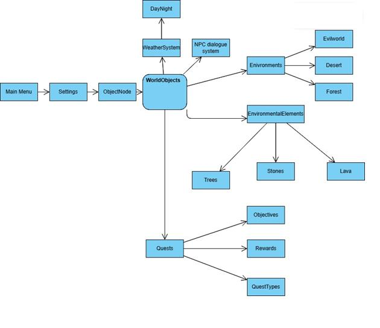
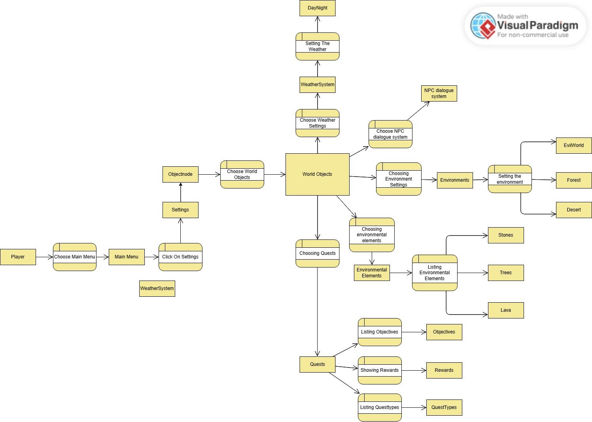
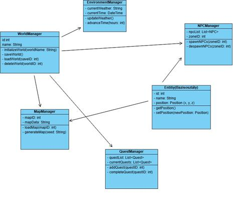

# Világ alrendszer modellje

## Statikus modell

### Kapcsolatok pontosítása

Az alábbi osztályok találhatók meg a Világ alrendszerben:

- **WorldManager**: Az összefogó osztály, amely kezeli a világ létrehozását, betöltését és törlését.
  - Kapcsolódik az alábbi osztályokhoz:
    - **MapManager**: A térképek generálását és karbantartását végzi.
    - **NPCManager**: Nem játékos karakterek (NPC-k) kezelése, létrehozása és irányítása.
    - **EnvironmentManager**: A világ fizikai és időjárási tulajdonságait kezeli.
    - **QuestManager**: A világban elérhető küldetéseket és eseményeket tartja nyilván.

### Attribútumok azonosítása

Az osztályok attribútumai:

- **WorldManager**
  - `worldName`: A világ neve.
  - `currentMap`: Az éppen aktív térkép azonosítója.
  - `timeOfDay`: A játék világában eltelt idő (például: nappal/éjszaka).
  - `activeQuests`: Az aktív küldetések listája.

- **MapManager**
  - `maps`: A térképek listája.
  - `activeZone`: Az éppen aktív zóna azonosítója.

- **NPCManager**
  - `npcList`: Az aktív NPC-k listája.
  - `spawnRate`: Az NPC-k újrateremtésének gyakorisága.

- **EnvironmentManager**
  - `weather`: Az aktuális időjárási állapot.
  - `dayCycle`: Az éjjel-nappal ciklus beállításai.

- **QuestManager**
  - `availableQuests`: Az elérhető küldetések listája.
  - `completedQuests`: A teljesített küldetések listája.

### Bázisosztályok keresése

- **Entity**: Bázisosztály lehet az NPC-k, objektumok és egyéb világelemek számára.
  - Attribútumok:
    - `id`: Egyedi azonosító.
    - `name`: Az entitás neve.
    - `position`: Az entitás helye a térképen.

## Dinamikus modell

A dinamikus modell a világ működése során bekövetkező folyamatokat írja le:

- **Világ inicializálása**: A játék betöltésekor a `WorldManager` elindítja a `MapManager`-t, `NPCManager`-t, és az `EnvironmentManager`-t.
- **Térkép váltása**: Amikor a játékos egy új zónába lép, a `MapManager` betölti az adott térképet, és az `NPCManager` újrateremti az NPC-ket.
- **Küldetések aktiválása**: A `QuestManager` aktiválja az adott térképen elérhető küldetéseket, amikor a játékos belép a zónába.

## Funkcionális modell

Az egyes osztályok funkciói:

- WorldManager
  - `initializeWorld(worldName)`: A világ inicializálása a megadott név alapján.
  - `saveWorld()`: A világ állapotának elmentése.
  - `loadWorld(saveID)`: Egy mentett világ betöltése.
  - `deleteWorld(worldID)`: Egy meglévő világ törlése.
- MapManager
  - `loadMap(mapID)`: Egy térkép betöltése.
  - `generateMap(seed)`: Új térkép generálása adott seed alapján.

## Operációk azonosítása

- **Világ betöltése**:
  - Műveletek:
    - `initializeWorld()`: A WorldManager elindítja a folyamatot.
    - `loadMap()`: A MapManager betölti az első térképet.
    - `spawnNPCs()`: Az NPCManager aktiválja a karaktereket.
    - `updateWeather()`: Az EnvironmentManager frissíti az időjárást.

- **Új térkép betöltése**:
  - Műveletek:
    - `loadMap()`: Betölti az új térképet.
    - `despawnNPCs()`: Az előző térkép NPC-it eltünteti.
    - `spawnNPCs()`: Az új térkép NPC-it létrehozza.

## Az analízis modell osztálydiagramja

## Az analízis modell osztályainak listája

### WorldManager

<table>
  <tr>
    <th>Felelősség</th>
    <th>Feladat</th>
  </tr>
  <tr>
    <td>Kezeli a világ állapotát, betöltést, mentést és törlést.</td>
    <td>A világ létrehozása, mentése és törlése.</td>
  </tr>
</table>

<table>
  <tr>
    <th>Együttműködők</th>
  </tr>
  <tr>
    <td>`MapManager`, `NPCManager`, `EnvironmentManager`, `QuestManager`</td>
  </tr>
</table>

<table>
  <tr>
    <th>Attribútum</th>
    <th>Típus</th>
    <th>Leírás</th>
  </tr>
  <tr>
    <td>`currentWorld`</td>
    <td>`Object`</td>
    <td>Az aktuális játékvilág tárolása.</td>
  </tr>
  <tr>
    <td>`worldState`</td>
    <td>`String`</td>
    <td>A világ aktuális állapota (pl. betöltve, mentve stb.).</td>
  </tr>
</table>

<table>
  <tr>
    <th>Operációk</th>
    <th>Argumentumok</th>
    <th>Működése, Feladata</th>
  </tr>
  <tr>
    <td>`initializeWorld()`</td>
    <td>nincs</td>
    <td>Inicializálja az új világot, előkészítve a kezdő térképet és NPC-ket.</td>
  </tr>
  <tr>
    <td>`loadWorld()`</td>
    <td>`worldFile`</td>
    <td>Betölti az adott világot egy fájlból.</td>
  </tr>
  <tr>
    <td>`saveWorld()`</td>
    <td>`worldFile`</td>
    <td>Ment egy világállapotot egy fájlba.</td>
  </tr>
  <tr>
    <td>`deleteWorld()`</td>
    <td>`worldFile`</td>
    <td>Törli a világot a fájlrendszerből.</td>
  </tr>
</table>

### NPCManager

<table>
  <thead>
    <tr>
      <th>Felelősség</th>
      <th>Feladat</th>
    </tr>
  </thead>
  <tbody>
    <tr>
      <td>Létrehozza és eltávolítja az NPC-ket az adott zónában.</td>
      <td>Az NPC-k kezelése, létrehozása, eltávolítása egy adott területen.</td>
    </tr>
  </tbody>
</table>

<table>
  <thead>
    <tr>
      <th>Együttműködők</th>
    </tr>
  </thead>
  <tbody>
    <tr>
      <td>`WorldManager`</td>
    </tr>
  </tbody>
</table>

<table>
  <thead>
    <tr>
      <th>Attribútumok</th>
      <th>Típus</th>
      <th>Leírás</th>
    </tr>
  </thead>
  <tbody>
    <tr>
      <td>`npcList`</td>
      <td>`List`</td>
      <td>Az összes NPC-t tárolja egy listában.</td>
    </tr>
  </tbody>
</table>

<table>
  <thead>
    <tr>
      <th>Operációk</th>
      <th>Argumentumok</th>
      <th>Működés, Feladat</th>
    </tr>
  </thead>
  <tbody>
    <tr>
      <td>`createNPC()`</td>
      <td>`npcData`</td>
      <td>Létrehozza az NPC-t a megadott adatok alapján.</td>
    </tr>
    <tr>
      <td>`removeNPC()`</td>
      <td>`npcID`</td>
      <td>Eltávolít egy NPC-t a világból az azonosítója alapján.</td>
    </tr>
    <tr>
      <td>`updateNPC()`</td>
      <td>`npcID`, `newData`</td>
      <td>Frissíti egy NPC adatait.</td>
    </tr>
  </tbody>
</table>

### MapManager

<table>
  <thead>
    <tr>
      <th>Felelősség</th>
      <th>Feladat</th>
    </tr>
  </thead>
  <tbody>
    <tr>
      <td>Kezeli a térképeket, beleértve azok betöltését és generálását.</td>
      <td>A játék világának térképeit generálja és kezeli.</td>
    </tr>
  </tbody>
</table>

<table>
  <thead>
    <tr>
      <th>Együttműködők</th>
    </tr>
  </thead>
  <tbody>
    <tr>
      <td>`WorldManager`</td>
    </tr>
  </tbody>
</table>

<table>
  <thead>
    <tr>
      <th>Attribútumok</th>
      <th>Típus</th>
      <th>Leírás</th>
    </tr>
  </thead>
  <tbody>
    <tr>
      <td>`mapData`</td>
      <td>`Object`</td>
      <td>A térkép adatainak tárolása.</td>
    </tr>
    <tr>
      <td>`mapSize`</td>
      <td>`int`</td>
      <td>A térkép mérete.</td>
    </tr>
  </tbody>
</table>

<table>
  <thead>
    <tr>
      <th>Operációk</th>
      <th>Argumentumok</th>
      <th>Működés, Feladat</th>
    </tr>
  </thead>
  <tbody>
    <tr>
      <td>`generateMap()`</td>
      <td>`mapSize`</td>
      <td>Létrehozza a térképet a megadott mérettel.</td>
    </tr>
    <tr>
      <td>`loadMap()`</td>
      <td>`mapSize`</td>
      <td>Betölti a térképet egy fájlból.</td>
    </tr>
    <tr>
      <td>`saveMap()`</td>
      <td>`mapSize`</td>
      <td>Elmenti a térképet egy fájlba.</td>
    </tr>
    <tr>
      <td>`removeMap()`</td>
      <td>`mapSize`</td>
      <td>Törli a jelenlegi térképet.</td>
    </tr>
  </tbody>
</table>

### EnvironmentManager

<table>
  <thead>
    <tr>
      <th>Felelősség</th>
      <th>Feladat</th>
    </tr>
  </thead>
  <tbody>
    <tr>
      <td>Frissíti az időjárást és kezeli az idő előrehaladását.</td>
      <td>Az időjárás és idő folyamatos változása a világban.</td>
    </tr>
  </tbody>
</table>

<table>
  <thead>
    <tr>
      <th>Együttműködők</th>
    </tr>
  </thead>
  <tbody>
    <tr>
      <td>`WorldManager`</td>
    </tr>
  </tbody>
</table>

<table>
  <thead>
    <tr>
      <th>Attribútumok</th>
      <th>Típus</th>
      <th>Leírás</th>
    </tr>
  </thead>
  <tbody>
    <tr>
      <td>`currentWeather`</td>
      <td>`String`</td>
      <td>Az aktuális időjárás (pl. napos, esős).</td>
    </tr>
    <tr>
      <td>`timeOfDay`</td>
      <td>`String`</td>
      <td>Az időpont (pl. reggel, délután).</td>
    </tr>
  </tbody>
</table>

<table>
  <thead>
    <tr>
      <th>Operációk</th>
      <th>Argumentumok</th>
      <th>Működés, Feladat</th>
    </tr>
  </thead>
  <tbody>
    <tr>
      <td>`updateWeather()`</td>
      <td>`weatherType`</td>
      <td>Frissíti az időjárást az új típusnak megfelelően.</td>
    </tr>
    <tr>
      <td>`updateTimeOfDay()`</td>
      <td>`timePeriod`</td>
      <td>Frissíti az időpontot (pl. nappali vagy éjjeli órákra).</td>
    </tr>
    <tr>
      <td>`getWeatherForecast()`</td>
      <td>nincs</td>
      <td>Megadja az előrejelzett időjárást egy adott időszakra.</td>
    </tr>
  </tbody>
</table>

### QuestManager

<table>
  <thead>
    <tr>
      <th>Felelősség</th>
      <th>Feladat</th>
    </tr>
  </thead>
  <tbody>
    <tr>
      <td>A küldetések kezelését végzi, beleértve azok hozzáadását és befejezését.</td>
      <td>A küldetések létrehozása, kezelése és befejezése a játékban.</td>
    </tr>
  </tbody>
</table>

<table>
  <thead>
    <tr>
      <th>Együttműködők</th>
    </tr>
  </thead>
  <tbody>
    <tr>
      <td>`WorldManager`</td>
    </tr>
  </tbody>
</table>

<table>
  <thead>
    <tr>
      <th>Attribútumok</th>
      <th>Típus</th>
      <th>Leírás</th>
    </tr>
  </thead>
  <tbody>
    <tr>
      <td>`quests`</td>
      <td>`List`</td>
      <td>A játékban elérhető küldetések listája.</td>
    </tr>
  </tbody>
</table>

<table>
  <thead>
    <tr>
      <th>Operációk</th>
      <th>Argumentumok</th>
      <th>Működés, Feladat</th>
    </tr>
  </thead>
  <tbody>
    <tr>
      <td>`addQuest()`</td>
      <td>`questData`</td>
      <td>Új küldetést ad hozzá a rendszerhez.</td>
    </tr>
    <tr>
      <td>`completeQuest()`</td>
      <td>`questID`</td>
      <td>Befejezi a megadott küldetést.</td>
    </tr>
    <tr>
      <td>`getActiveQuests()`</td>
      <td>nincs</td>
      <td>Lekéri az aktív küldetéseket, amelyek még nem lettek befejezve.</td>
    </tr>
  </tbody>
</table>

### BaseEntity

<table>
  <thead>
    <tr>
      <th>Felelősség</th>
      <th>Feladat</th>
    </tr>
  </thead>
  <tbody>
    <tr>
      <td>Az alapvető entitások, mint NPC-k, objektumok stb. közös tulajdonságait és metódusait tartalmazza.</td>
      <td>A világ összes entitásának közös tulajdonságai és metódusai.</td>
    </tr>
  </tbody>
</table>

<table>
  <thead>
    <tr>
      <th>Együttműködők</th>
    </tr>
  </thead>
  <tbody>
    <tr>
      <td>`NPCManager`, `MapManager`</td>
    </tr>
  </tbody>
</table>

<table>
  <thead>
    <tr>
      <th>Attribútumok</th>
      <th>Típus</th>
      <th>Leírás</th>
    </tr>
  </thead>
  <tbody>
    <tr>
      <td>`id`</td>
      <td>`int`</td>
      <td>Az entitás egyedi azonosítója.</td>
    </tr>
    <tr>
      <td>`position`</td>
      <td>`Vector3`</td>
      <td>Az entitás pozíciója a térképen.</td>
    </tr>
    <tr>
      <td>`entityType`</td>
      <td>`String`</td>
      <td>Az entitás típusa (pl. NPC, objektum).</td>
    </tr>
  </tbody>
</table>

<table>
  <thead>
    <tr>
      <th>Operációk</th>
      <th>Argumentumok</th>
      <th>Működés, Feladat</th>
    </tr>
  </thead>
  <tbody>
    <tr>
      <td>`moveEntity()`</td>
      <td>`destroyEntity()`</td>
      <td>Az entitás elmozdítása az új pozícióra.</td>
    </tr>
    <tr>
      <td>`interactWith()`</td>
      <td>`entityID`</td>
      <td>Interakció más entitással.</td>
    </tr>
    <tr>
      <td>`destroyEntity()`</td>
      <td>nincs</td>
      <td>Az entitás eltávolítása a világból.</td>
    </tr>
  </tbody>
</table>
