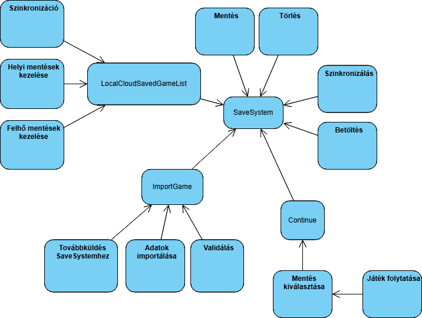
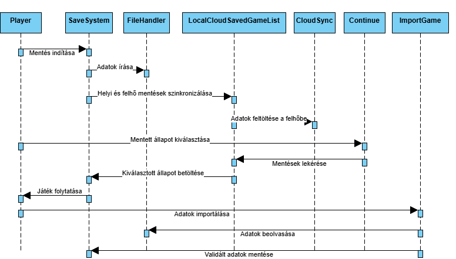
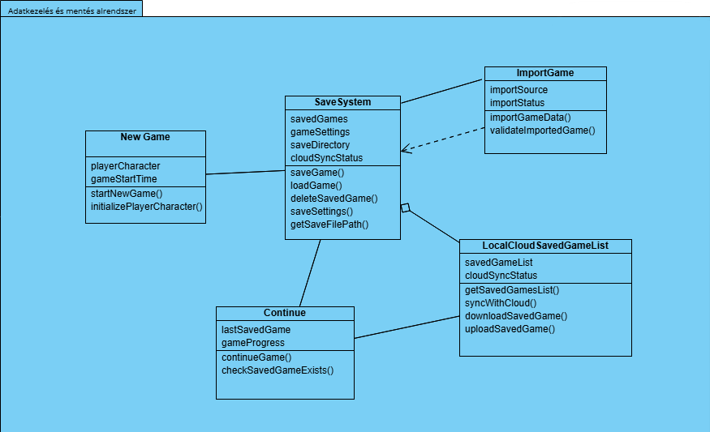

# Adatkezelés és mentés alrendszer

## Statikus modell

### Kapcsolatok

1. **SaveSystem --- ImportGame:**
   - A SaveSystem használja az ImportGame-et az importálási műveletekhez. Az importálás eredménye a SaveSystem mentési listájába kerülhet.

2. **SaveSystem --- Continue:**
   - A SaveSystem közvetlenül kapcsolódik a Continue-hoz, mivel a mentett állapotokat a SaveSystem tárolja és a Continue azon keresztül tölti be a játékot.

3. **SaveSystem --- LocalCloudSavedGameList:**
   - A SaveSystem és a LocalCloudSavedGameList szinkronizálják a mentett játékokat helyben és felhőben. Az adatok elérhetők és szinkronizálhatók a felhővel, ami lehetővé teszi a több eszköz közötti átvitelét.

4. **ImportGame --- SaveSystem:**
   - Az ImportGame az adatokat betölti és validálja, majd a SaveSystem kezeli a mentett állapotokat.

5. **New Game --- SaveSystem:**
   - A New Game kezdeményezi az új játékot, amelyet a SaveSystem menthet és kezelhet.

6. **LocalCloudSavedGameList --- Continue:**
   - A LocalCloudSavedGameList biztosítja a mentett játékok listáját a Continue számára, hogy a játékos folytathassa a játékot a mentett állapotokból.

Az alrendszerek közötti kapcsolatok lehetővé teszik, hogy a játékos különböző játékállapotokat importáljon, folytasson, mentse és szinkronizálja azokat helyben vagy a felhőben, miközben minden adat összhangban van a rendszer többi komponensével.

### Osztályok és azok attribútumainak azonosítása és műveleteik

**SaveSystem**

- **Attribútumok:**
  - `savedGames`: Lista, amely tartalmazza az elérhető mentett játékokat.
  - `gameSettings`: A játék beállításait tároló objektum (pl. grafikai, hangbeállítások).
  - `saveDirectory`: Az elérési út a mentési fájlokhoz.
  - `cloudSyncStatus`: Információ arról, hogy a felhő szinkronizálás aktív-e vagy sem.

- **Műveletek:**
  - `saveGame()`: Ment egy új játékot vagy felülír egy meglévőt.
  - `loadGame()`: Betölti a játékot egy adott mentett állapotból.
  - `deleteSavedGame()`: Törli a mentett játékot.
  - `saveSettings()`: Menthetők a beállítások.
  - `getSaveFilePath()`: Visszaadja a mentési fájl helyét.

**ImportGame**

- **Attribútumok:**
  - `importSource`: Forrás, ahonnan az adatokat importálni kell (pl. másik eszköz, fájl, felhő).
  - `importStatus`: Az importálás állapota (sikeres vagy hibás).

- **Műveletek:**
  - `importGameData()`: Importálja a játék adatokat.
  - `validateImportedGame()`: Validálja az importált adatokat.

**Continue**

- **Attribútumok:**
  - `lastSavedGame`: A legutóbb mentett játék adatai.
  - `gameProgress`: A játékban elért előrehaladás (pl. szint, küldetés).

- **Műveletek:**
  - `continueGame()`: Folytatja a legutóbbi mentett játékot.
  - `checkSavedGameExists()`: Ellenőrzi, hogy van-e elérhető mentett játék a folytatáshoz.

**New Game**

- **Attribútumok:**
  - `playerCharacter`: A játékos karaktere, amelyet új játék kezdetekor kell inicializálni.
  - `gameStartTime`: Az új játék kezdési ideje.

- **Műveletek:**
  - `startNewGame()`: Létrehozza az új játékot.
  - `initializePlayerCharacter()`: Inicializálja a játékos karakterét.

**LocalCloudSavedGameList**

- **Attribútumok:**
  - `savedGameList`: A mentett játékok listája.
  - `cloudSyncStatus`: A felhő szinkronizálásának státusza.
- **Műveletek:**
  - `getSavedGamesList():` Lekéri a mentett játékok listáját helyben vagy a felhőből.
  - `syncWithCloud():` Szinkronizálja a mentéseket a felhővel.
  - `downloadSavedGame():` Letölti a mentett játékot.
  - `uploadSavedGame():` Feltölti a mentett játékot a felhőbe.

### Bázisosztályok keresése

1. FileHandler
    - **Szerepe:** Általános osztály a fájlműveletekhez, amely minden olyan komponens számára hasznos, amely fájlokat olvas, ír vagy töröl.
    - **Attribútumok:**
      - `filePath:` A fájl elérési útja.
      - `fileFormat:` A fájl formátuma (pl. JSON, XML, bináris).
    Műveletek:
      - `readFile():` Fájl olvasása.
      - `writeFile(data):` Adat írása a fájlba.
      - `deleteFile():` Fájl törlése.
    - **Örökölheti:**
      - `SaveSystem`
      - `LocalCloudSavedGameList`
      - `ImportGame`

2. GameData
    - **Szerepe:** Az osztály, amely a játék adatstruktúráit definiálja, például a játékos állapotát, beállításait vagy világadatait.
    - **Attribútumok:**
      - `playerState`: A játékos aktuális állapota (pl. életerő, pozíció).
      - `gameSettings`: A játék beállításai (pl. nehézség, vezérlők).
      - `worldState`: A világ aktuális állapota (pl. NPC-k, küldetések).
    - Műveletek:
      - `serialize()`: Az adatok sorosítása mentéshez.
      - `deserialize()`: Az adatok visszaállítása fájlból vagy memóriából.
    - **Örökölheti:**
      - `SaveSystem`
      - `Continue`
      - `New Game`

3. CloudSync
    - **Szerepe:** Az osztály a felhővel való kapcsolódáshoz szükséges funkciókat biztosítja.
    - **Attribútumok:**
      - `cloudServiceURL`: A felhőszolgáltatás URL-je.
      - `authToken`: Hitelesítési token a hozzáféréshez.
      - **Műveletek:**
      - `upload(data)`: Adatok feltöltése a felhőbe.
      - `download()`: Adatok letöltése a felhőből.
      - `sync()`: Helyi és felhő adatok szinkronizálása.
    - **Örökölheti:**
      - `LocalCloudSavedGameList`

4. GameAction
    - **Szerepe:** Általános osztály a játékmenet akcióihoz, például új játék indítása, mentés
  betöltése vagy folytatás.
    - **Attribútumok:**
      - `actionName`: Az akció neve (pl. "Continue", "New Game").
      - `actionTimestamp`: Az akció végrehajtásának időpontja.
    - **Műveletek:**
      - `execute()`: Az akció végrehajtása.
    - **Örökölheti:**
      - `New Game`
      - `Continue`

## Dinamikus modell

## Funkcionális modell

## Operációk azonosítása

- **`SaveSystem:`**
  - `saveGame(data: GameData): Boolean`
  - `loadGame(saveID: String): GameData`
  - `deleteSave(saveID: String): Boolean`
  - `syncSaves(): Boolean`
  - `getAvailableSaves(): List<String>`

- **`ImportGame:`**
  - `importData(sourcePath: String): GameData`
  - `validateData(data: GameData): Boolean`
  - `sendToSaveSystem(data: GameData): Boolean`

- **`LocalCloudSavedGameList`:**
  - `getLocalSaves(): List<String>`
  - `getCloudSaves(): List<String>`
  - `syncSaves(): Boolean`
  - `getSaveInfo(saveID: String): SaveMetadata`

- **`Continue:`**
  - `selectSave(saveID: String): Boolean`
  - `continueGame(): GameData`

- **`New Game:`**
  - `initializeNewGame(settings: GameSettings): GameData`
  - `createInitialSave(data:GameData): Boolean`

## Az analízis modell osztálydiagramja

### SaveSystem

**Felelőssége, feladata:** Kezeli a játék mentését, betöltését, törlését és szinkronizálását helyben vagy felhőben.

**Együttműködők:**

- `ImportGame`: Adatimportáláshoz.
- `LocalCloudSavedGameList`: Mentett játékok listájának kezeléséhez.
- `Continue`: Mentett játék betöltéséhez.
- `New Game`: Új játék létrehozásához.

**Attribútumok**

<table>
  <thead>
    <tr>
      <th>Név</th>
      <th>Típus</th>
      <th>Leírás</th>
    </tr>
  </thead>
  <tbody>
    <tr>
      <td>`saveData`</td>
      <td>`GameData`</td>
      <td>A mentett játék adatai.</td>
    </tr>
    <tr>
      <td>`savePath`</td>
      <td>`String`</td>
      <td>A mentési fájl helyi elérési útja.</td>
    </tr>
    <tr>
      <td>`cloudEnabled`</td>
      <td>`Boolean`</td>
      <td>A felhőszinkronizáció engedélyezése.</td>
    </tr>
    <tr>
      <td>`lastSaveTimestamp`</td>
      <td>`DateTime`</td>
      <td>Az utolsó mentés időpontja.</td>
    </tr>
  </tbody>
</table>

**Operációk**

<table>
  <thead>
    <tr>
      <th>Név</th>
      <th>Argumentumok</th>
      <th>Működése, feladata</th>
    </tr>
  </thead>
  <tbody>
    <tr>
      <td>saveGame</td>
      <td>data: GameData</td>
      <td>Elmenti az aktuális játékállapotot fájlba vagy felhőbe.</td>
    </tr>
    <tr>
      <td>loadGame</td>
      <td>saveID: String</td>
      <td>Betölti a kiválasztott mentést helyről vagy felhőből.</td>
    </tr>
    <tr>
      <td>deleteSave</td>
      <td>saveID: String</td>
      <td>Törli a megadott mentést.</td>
    </tr>
    <tr>
      <td>syncSaves</td>
      <td>Nincs</td>
      <td>Szinkronizálja a mentéseket a felhővel.</td>
    </tr>
  </tbody>
</table>

### ImportGame

**Felelőssége, feladata:** Más játékokból vagy fájlformátumokból származó adatok importálása a rendszerbe.

**Együttműködők:**

- `SaveSystem`: Az importált adatokat továbbítja a mentés kezeléséhez.

**Attribútumok:**

<table>
  <thead>
    <tr>
      <th>Név</th>
      <th>Típus</th>
      <th>Leírás</th>
    </tr>
  </thead>
  <tbody>
    <tr>
      <td>`importFormat`</td>
      <td>`String`</td>
      <td>Az importálás formátuma (JSON, XML).</td>
    </tr>
    <tr>
      <td>`sourcePath`</td>
      <td>`String`</td>
      <td>Az importált fájl elérési útja.</td>
    </tr>
    <tr>
      <td>`importedData`</td>
      <td>`GameData`</td>
      <td>Az importált adatstruktúra.</td>
    </tr>
  </tbody>
</table>

**Operációk:**

<table>
  <thead>
    <tr>
      <th>Név</th>
      <th>Argumentumok</th>
      <th>Működése, feladata</th>
    </tr>
  </thead>
  <tbody>
    <tr>
      <td>`importData`</td>
      <td>`sourcePath: String`</td>
      <td>Betölti az adatokat a megadott fájlból.</td>
    </tr>
    <tr>
      <td>`validateData`</td>
      <td>`data: GameData`</td>
      <td>Ellenőrzi az importált adatok érvényességét.</td>
    </tr>
    <tr>
      <td>`sendToSave`</td>
      <td>`data: GameData`</td>
      <td>Továbbítja az adatokat a SaveSystem-nek mentésre.</td>
    </tr>
  </tbody>
</table>

### LocalCloudSavedGameList

**Felelőssége, feladata:** Kezeli a mentett játékok helyi és felhőbeli listáját.

**Együttműködők:**

- `SaveSystem`: A mentett játékok eléréséhez és szinkronizálásához.
- `Continue`: A mentett játék kiválasztásához.

**Attribútumok:**

<table>
  <thead>
    <tr>
      <th>Név</th>
      <th>Típus</th>
      <th>Leírás</th>
    </tr>
  </thead>
  <tbody>
    <tr>
      <td>`localSaves`</td>
      <td>`List<String>`</td>
      <td>A helyi mentések azonosítói.</td>
    </tr>
    <tr>
      <td>`cloudSaves`</td>
      <td>`List<String>`</td>
      <td>A felhőben tárolt mentések azonosítói.</td>
    </tr>
    <tr>
      <td>`syncStatus`</td>
      <td>`Boolean`</td>
      <td>A szinkronizáció aktuális állapota.</td>
    </tr>
  </tbody>
</table>

**Operációk:**

<table>
  <thead>
    <tr>
      <th>Név</th>
      <th>Argumentumok</th>
      <th>Működése, feladata</th>
    </tr>
  </thead>
  <tbody>
    <tr>
      <td>`getSaveList`</td>
      <td>Nincs</td>
      <td>Visszaadja az elérhető mentések listáját.</td>
    </tr>
    <tr>
      <td>`syncSaves`</td>
      <td>Nincs</td>
      <td>Szinkronizálja a helyi és felhőbeli mentéseket.</td>
    </tr>
  </tbody>
</table>

### Continue

**Felelőssége, feladata:** Lehetővé teszi a játékos számára egy mentett játék folytatását.

**Együttműködők:**

- `SaveSystem`: A mentett állapot betöltéséhez.
- `LocalCloudSavedGameList`: A mentések listájának lekérdezéséhez.

**Attribútumok:**

<table>
  <thead>
    <tr>
      <th>Név</th>
      <th>Típus</th>
      <th>Leírás</th>
    </tr>
  </thead>
  <tbody>
    <tr>
      <td>`selectedSave`</td>
      <td>`String`</td>
      <td>Az aktuálisan kiválasztott mentés azonosítója.</td>
    </tr>
  </tbody>
</table>

**Operációk:**

<table>
  <thead>
    <tr>
      <th>Név</th>
      <th>Argumentumok</th>
      <th>Működése, feladata</th>
    </tr>
  </thead>
  <tbody>
    <tr>
      <td>`selectSave`</td>
      <td>`saveID: String`</td>
      <td>Kiválasztja a folytatni kívánt mentést.</td>
    </tr>
    <tr>
      <td>`continueGame`</td>
      <td>`saveID: String`</td>
      <td>Betölti a kiválasztott mentett állapotot.</td>
    </tr>
  </tbody>
</table>
