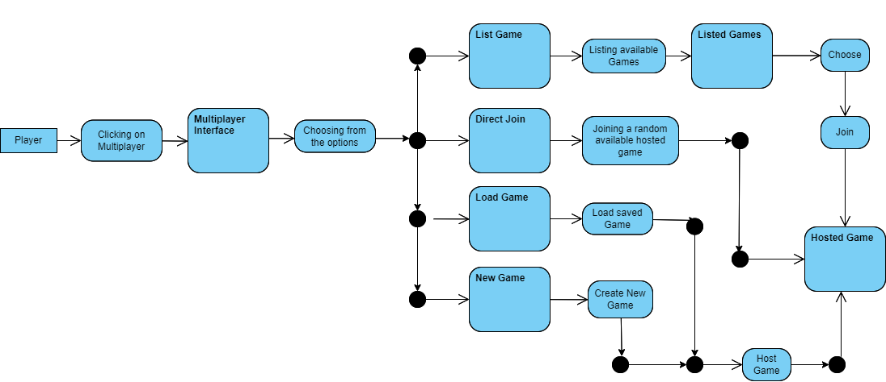
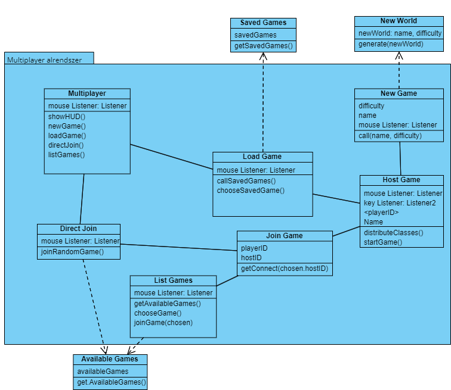

# A multiplayer alrendszer modellje

## Statikus modell

### Kapcsolatok pontosítása

Az osztálydiagramon való  kapcsolatok tisztázása és meghatározása, hogy a különböző elemek hogyan függnek egymástól. Az alábbi osztályok találhatóak meg a Multiplayer alrendszerben:

- **Multiplayer:** Az összefűző osztály, amely kezeli a mentéseket és irányításokat és innen érhetjük el a többi osztály funkcióit. Ezekkel az osztályokkal áll kapcsolatban:
  - **New Game:** Hívásakor új játékot hozunk létre, melyet elmentve majd megoszthatunk egy másik osztályban, a Host Game-ben
  - **My Games:** A meglévő játékokat folytatjuk, esetleg megoszthatjuk a Host Game osztályban, hogy mások is csatlakozhassanak hozzánk
  - **Join Game:** A List Game osztályban listázott játékokból egy kiválasztott játékhoz csatlakozunk ezzel az osztállyal
  - **Direct Join:** Lehetőséget biztosít egy elérhető online játék mihamarabbi csatlakozásához
  - **Host Game:** Egy új vagy folytatott játék megosztása másokkal, így csatlakozhatnak a csapatba
  - **List Game:** Az elérhető online játékokat listázza, ahova majd a Join Game osztállyal csatlakozhatunk

Ezek az osztályok mind a `Multiplayer` központi osztályból indulnak ki, és egy irányított kapcsolatot jelenítenek meg, ami meghatározza, hogyan lehet elérni az egyes funkciókat.

### Attribútumok azonosítása

Az alábbi releváns attribútumokat rendeljük hozzá az alrendszer osztályaihoz:

- **New Game:** tartalmazhat olyan attribútumokat, mint a `gameName`, `maxPlayers`, `gameMode`, `gameDifficulty`, `gameVisibility` (Csatlakozhatnak-e hozzá).
- **My Games:** tartalmazza a `savedGames` listáját, amely a korábban létrehozott játékokat és adataikat tárolja és megjeleníti.
- **Join Game:** Olyan attribútumokkal rendelkezik, mint a `gameID` és `playerID` a legkönnyebb csatlakozás eléréséhez.
- **Host Game:** tartalmazza a `hostName`, `playerLimit` attribútumokat, illetve egy származtatott `isGameVisible` attribútumot.
- **List Game:** Tartalmazza a `availableGames` attribútumot, amely a jelenleg elérhető játékokat listázza és jeleníti meg a `gameVisibility` keretében.

### Bázisosztályok keresése

Az esetleges bázisosztály a Game lehet, amely általános tulajdonságokat hordoz, amit más osztály is megörökölhet. Ezen tulajdonságok a következők lehetnek: 

- `gameName`
- `players`
- `status (active, paused, finished)`
- `gameVisibility`

Az egyes specifikus játékállapotok, mint például `New Game`, `Join Game`, és `Host Game`, származhatnak ebből a bázisosztályból, mivel valamennyi feltüntetett tulajdonság megtalálható bennük.

### Dinamikus modell

## Funkcionális modell

## Operációk azonosítása

Az osztálydiagramot kiegészítő az egyes osztályokhoz tartozó műveletek:

- **Mainmenu:** `setMultiplayerInterface()`
- **New Game:** `createGame()`, `configureGame()`, `startGame()`
- **Load Game:** `listSavedGames()`, `chooseFromSavedGames()`, `loadGame(chosenID)`, `startGame()`
- **Direct Join:** `selectRandomGame()`, `joinGame()`
- **Host Game:** `shareGame(chosenID)`, `managePlayers()`, `setPlayerCharacters()`
- **List Game:** `fetchAvailableGames()`
- **Join:** `chooseGame()`, `joinGame(chosenID)`

## Az analízis modell osztálydiagramja

### Multiplayer

- **Felelőssége, feladata:** A HUD és a multiplayer felület kezelése, emellett itt hívjuk meg a többi osztály függvényeit.
- **Együttműködők:** New Game, Load Game, List Games, Direct Join

**Attribútumok:**

<table>
  <thead>
    <tr>
      <th>Név</th>
      <th>Típus</th>
      <th>Leírás</th>
    </tr>
  </thead>
  <tbody>
    <tr>
      <td>`mouseListener`</td>
      <td>`Listener`</td>
      <td>Az egér kattintásával való irányítás az opciók között.</td>
    </tr>
  </tbody>
</table>

**Operációk:**

<table>
  <thead>
    <tr>
      <th>Név</th>
      <th>Argumentumok</th>
      <th>Működése, feladata</th>
    </tr>
  </thead>
  <tbody>
    <tr>
      <td>`showHUD()`</td>
      <td>Nincs</td>
      <td>A HUD megalkotása és megvalósítása.</td>
    </tr>
    <tr>
      <td>`newGame()`</td>
      <td>Nincs</td>
      <td>`New Game` osztály meghívása és elkezdése.</td>
    </tr>
    <tr>
      <td>`loadGame()`</td>
      <td>Nincs</td>
      <td>Elmentett játék betöltésére szolgáló osztály meghívása.</td>
    </tr>
    <tr>
      <td>`directJoin()`</td>
      <td>Nincs</td>
      <td>Véletlenszerű elérhető játékba való csatlakozás előkészülete.</td>
    </tr>
    <tr>
      <td>`listGames()`</td>
      <td>Nincs</td>
      <td>Egy listázást indít el, ahol kiírja az összes elérhető online játékot.</td>
    </tr>
  </tbody>
</table>

### New Game

- **Felelőssége, feladata:** Az adott attribútumokkal előállít egy hívást, mely  létrehoz egy világot, amit utána megosztunk.
- **Együttműködők:** `New World`, `Host Game`

**Attribútumok:**

<table>
  <thead>
    <tr>
      <th>Név</th>
      <th>Típus</th>
      <th>Leírás</th>
    </tr>
  </thead>
  <tbody>
    <tr>
      <td>`name`</td>
      <td>`String`</td>
      <td>A világ neve lesz ez a `String`.</td>
    </tr>
    <tr>
      <td>`difficulty`</td>
      <td>`String`</td>
      <td>A világ nehézségét állítja be majd a `String` tartalma.</td>
    </tr>
    <tr>
      <td>`mouseListener`</td>
      <td>`Listener`</td>
      <td>A kattintási lehetőségnek megfelelően `mouseListener`t használunk.</td>
    </tr>
  </tbody>
</table>

**Operációk:**

<table>
  <thead>
    <tr>
      <th>Név</th>
      <th>Argumentumok</th>
      <th>Működése, feladata</th>
    </tr>
  </thead>
  <tbody>
    <tr>
      <td>`call()`</td>
      <td>`name`, `difficulty`</td>
      <td>Az adott argumentumokkal hívja meg a `New World` osztályt, hogy előállítson egy világot, majd tovább küldje `Host Game`-nek.</td>
    </tr>
  </tbody>
</table>

### New World

- **felelőssége, feladata:** Feladata a két argumentummal előállítani egy új világot a játékos számára, amit vissza is ad hhívásakor a New Game-be
- **Együttműködők:** `New Game`

**Attribútumok:**

<table>
  <thead>
    <tr>
      <th>Név</th>
      <th>Típus</th>
      <th>Leírás</th>
    </tr>
  </thead>
  <tbody>
    <tr>
      <td>`newWorld`</td>
      <td>`Objektum`</td>
      <td>A `name` és `difficulty` alapján jön létre konstruktor alapján, mely meghatározza a játékvilágot.</td>
    </tr>
  </tbody>
</table>

**Operációk:**

<table>
  <thead>
    <tr>
      <th>Név</th>
      <th>Argumentumok</th>
      <th>Működése, feladata</th>
    </tr>
  </thead>
  <tbody>
    <tr>
      <td>`generate()`</td>
      <td>`newWorld`</td>
      <td>A megadott konstruktori beállításokkal az objektum alapján elkészíti a világot és visszaküldi `New Game`-nek.</td>
    </tr>
  </tbody>
</table>

### Load Game

- **Felelőssége, feladata:** Az elmentett végigjátszásunkat tölti be.
- **Együttműködők:** `Saved Games`, `Host Game`

**Attribútumok:**

<table>
  <thead>
    <tr>
      <th>Név</th>
      <th>Típus</th>
      <th>Leírás</th>
    </tr>
  </thead>
  <tbody>
    <tr>
      <td>`mouseListener`</td>
      <td>`Listener`</td>
      <td>A kiválasztás és kattintás miatt használjuk fel.</td>
    </tr>
  </tbody>
</table>

**Operációk:**

<table>
  <thead>
    <tr>
      <th>Név</th>
      <th>Argumentumok</th>
      <th>Működése, feladata</th>
    </tr>
  </thead>
  <tbody>
    <tr>
      <td>`callSavedGames()`</td>
      <td>Nincs</td>
      <td>Lekéri az összes elmentett játékunkat a `Saved Games` osztályból.</td>
    </tr>
    <tr>
      <td>`chooseSavedGame()`</td>
      <td>Nincs</td>
      <td>Kiválasztja a betölteni kívánt mentést és tovább küldi a `Host Game`-be.</td>
    </tr>
  </tbody>
</table>

### Saved Games

- **Felelőssége, feladata:** Tárolja, betölti, és kiválasztáskor elküldi az elmentett játékainkat
- **Együttműködők:** `Load Game`

**Attribútumok:**

<table>
  <thead>
    <tr>
      <th>Név</th>
      <th>Típus</th>
      <th>Leírás</th>
    </tr>
  </thead>
  <tbody>
    <tr>
      <td>`savedGames`</td>
      <td>`dinamic array`</td>
      <td>Tárolja az elmentett világainkat.</td>
    </tr>
  </tbody>
</table>

**Operációk:**

<table>
  <thead>
    <tr>
      <th>Név</th>
      <th>Argumentumok</th>
      <th>Működése, feladata</th>
    </tr>
  </thead>
  <tbody>
    <tr>
      <td>`getSavedGames()`</td>
      <td>Nincs</td>
      <td>Lekéri az elmentett világainkat, hogy abból majd tudjunk választani a `Load Game`-ben.</td>
    </tr>
  </tbody>
</table>

### Direct Join

- **Felelőssége, feladata:** Egy véletlenszerű, de elérhető online világhoz csatlakozik.
- **Együttműködők:** `Available Games`, `Join Games`

**Attribútumok:**

<table>
  <thead>
    <tr>
      <th>Név</th>
      <th>Típus</th>
      <th>Leírás</th>
    </tr>
  </thead>
  <tbody>
    <tr>
      <td>`mouseListener`</td>
      <td>`Listener`</td>
      <td>Kattintással indítjuk el a folyamatát az osztálynak.</td>
    </tr>
  </tbody>
</table>

**Operációk:**

<table>
  <thead>
    <tr>
      <th>Név</th>
      <th>Argumentumok</th>
      <th>Működése, feladata</th>
    </tr>
  </thead>
  <tbody>
    <tr>
      <td>`joinRandomGame()`</td>
      <td>Nincs</td>
      <td>Kiválaszt egy véletlenszerű elérhető játékot és annak ID-jait küldi a `Join Game`-be.</td>
    </tr>
  </tbody>
</table>

### List Games

- **Felelőssége, feladata:** Listázza az összes elérhető online játékot, amihet tudunk csatlakozni
- **Együttműködők:** `Available Games`, `Join Game`

**Attribútumok:**

<table>
  <thead>
    <tr>
      <th>Név</th>
      <th>Típus</th>
      <th>Leírás</th>
    </tr>
  </thead>
  <tbody>
    <tr>
      <td>`mouseListener`</td>
      <td>`Listener`</td>
      <td>A listázás és kiválasztáshoz felhasználjuk.</td>
    </tr>
  </tbody>
</table>

**Operációk:**

<table>
  <thead>
    <tr>
      <th>Név</th>
      <th>Argumentumok</th>
      <th>Működése, feladata</th>
    </tr>
  </thead>
  <tbody>
    <tr>
      <td>`getAvailableGames()`</td>
      <td>Nincs</td>
      <td>Listázza az `Available Games`-ből lekérve a játékokat.</td>
    </tr>
    <tr>
      <td>`chooseGame()`</td>
      <td>Nincs</td>
      <td>Kiválasztjuk azt a játékot, amihez csatlakozni szeretnénk.</td>
    </tr>
    <tr>
      <td>`joinGame(chosen)`</td>
      <td>Nincs</td>
      <td>Továbbküldi a kiválasztott világ tulajdonságait a `Join Game`-nek.</td>
    </tr>
  </tbody>
</table>

### Available Games

- **Felelőssége, feladata:** Tárolja az elérhető online világokat, amikhez tudunk csatlakozni
- **Együttműködők:** `Direct Join`, `List Games`

**Attribútumok:**

<table>
  <thead>
    <tr>
      <th>Név</th>
      <th>Típus</th>
      <th>Leírás</th>
    </tr>
  </thead>
  <tbody>
    <tr>
      <td>`availableGames`</td>
      <td>`dinamic array`</td>
      <td>Tárolja az elérhető játékokat.</td>
    </tr>
  </tbody>
</table>

**Operációk:**

<table>
  <thead>
    <tr>
      <th>Név</th>
      <th>Argumentumok</th>
      <th>Működése, feladata</th>
    </tr>
  </thead>
  <tbody>
    <tr>
      <td>`getAvailableGames()`</td>
      <td>Nincs</td>
      <td>Lekéri és kiírja az elérhető játékokat, amiből majd tudunk választani/véletlenszerűen választunk.</td>
    </tr>
  </tbody>
</table>

### Join Game

- **Felelőssége, feladata:** A megkapott online világhoz csatlakoztat minket a Host Game-ben
- **Együttműködők:** `Direct Join`, `List Games`, `Host Game`

**Attribútumok:**

<table>
  <thead>
    <tr>
      <th>Név</th>
      <th>Típus</th>
      <th>Leírás</th>
    </tr>
  </thead>
  <tbody>
    <tr>
      <td>`playerID`</td>
      <td>`long int`</td>
      <td>A játékosunk személyes ID-je.</td>
    </tr>
    <tr>
      <td>`hostID`</td>
      <td>`long int`</td>
      <td>A világ ID-ja, amihez csatlakozni akarunk.</td>
    </tr>
  </tbody>
</table>

**Operációk:**

<table>
  <thead>
    <tr>
      <th>Név</th>
      <th>Argumentumok</th>
      <th>Működése, feladata</th>
    </tr>
  </thead>
  <tbody>
    <tr>
      <td>`getConnect()`</td>
      <td>`chosen`, `hostID`</td>
      <td>A kiválasztott világhoz csatlakoztat minket és tovább küld a `Host Game` osztályba.</td>
    </tr>
  </tbody>
</table>

### Host Game

- **Felelőssége, feladata:** Itt valósul meg a játék kezdése, ahol minden játékos saját ID-vel rendelkezik és csapatban játszanak.
- **Együttműködők:** `New Game`, `Load Game`, `Join Game`

**Attribútumok:**

<table>
  <thead>
    <tr>
      <th>Név</th>
      <th>Típus</th>
      <th>Leírás</th>
    </tr>
  </thead>
  <tbody>
    <tr>
      <td>`mouseListener`</td>
      <td>`Listener`</td>
      <td>Az egér irányításához és a kattintásos opciókhoz használva.</td>
    </tr>
    <tr>
      <td>`keyListener`</td>
      <td>`Listener`</td>
      <td>A billentyűgombjainak és kombinációinak használatához.</td>
    </tr>
    <tr>
      <td>`playerID`</td>
      <td>`array`</td>
      <td>Fix méretű tömb a játékosok ID-jével.</td>
    </tr>
    <tr>
      <td>`Name`</td>
      <td>`String`</td>
      <td>A játékosok nevei.</td>
    </tr>
  </tbody>
</table>

**Operációk:**

<table>
  <thead>
    <tr>
      <th>Név</th>
      <th>Argumentumok</th>
      <th>Működése, feladata</th>
    </tr>
  </thead>
  <tbody>
    <tr>
      <td>`distributeClasses()`</td>
      <td>Nincs</td>
      <td>Kiosztja a megadott kasztokat a játékosoknak.</td>
    </tr>
    <tr>
      <td>`startGame()`</td>
      <td>Nincs</td>
      <td>Elkezdi a játékot multiplayer-ben játszani.</td>
    </tr>
  </tbody>
</table>
