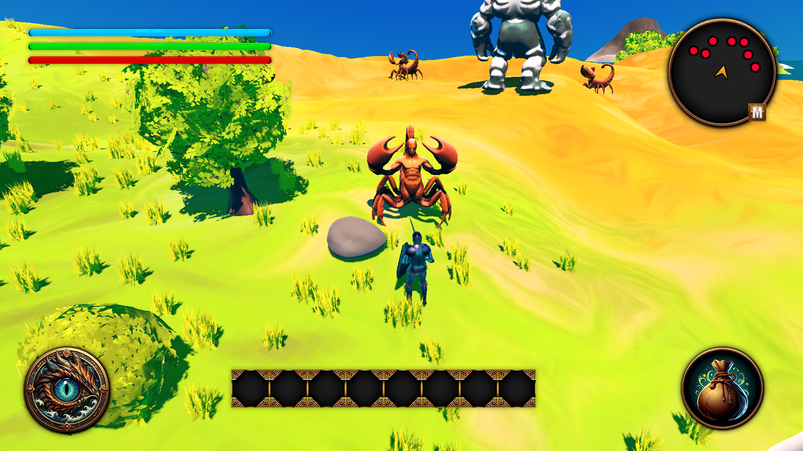
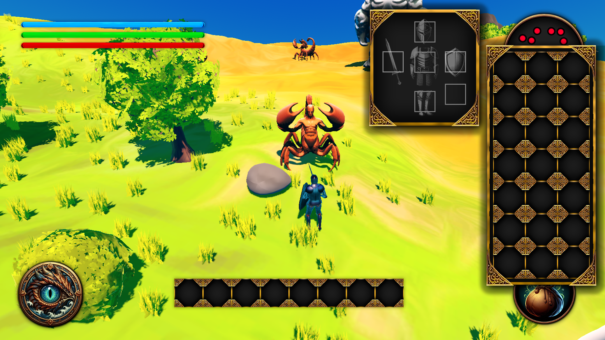

# Felhasználói felület

Az alábbi HUD (felhasználói felület) elemek segítik a játékos tájékozódását és a játékmenet irányítását:

- Sárkányszem ikon (bal alsó sarok):
  - Egy ikon, amelyre kattintva a játékos megtekintheti a karakter statisztikáit.
  - Itt található a négy skill fejlesztési csíkja. Ha elérhető fejlesztési pont áll rendelkezésre, egy „+” jel jelenik meg az adott skillnél, lehetővé téve annak fejlesztését.
- Zsák ikon (bal alsó sarok):
  - Az ikonra kattintva az inventory (felszerelés és tárgykezelő) jelenik meg.
  - Az inventory-ban a játékos:
    - Megtekintheti, hogy mit visel (pl. kard, sisak, mellvért, pajzs, csizma).
    - Kezelheti a tárgyait, amelyek 3x7-es rácsban (21 hely) tárolhatók.
    - Minden viselt tárgy és inventory slot mellett található egy „X” gomb, amely lehetővé teszi a felszerelés levételét vagy a tárgyak eltávolítását.
- Élet-, mana- és józanság-sávok (bal felső sarok):
  - Az élet, mana és józanság aktuális állapotát vizuálisan jelzik a sávok.
- Mini térkép (jobb felső sarok):
  - Kör alakú minimap, amely a következőket jeleníti meg:
    - Piros körök: ellenségek.
    - Zöld körök: NPC-k.
    - Arany nyílfej: a játékos helyzetét mutatja.
  - A minimap nem részletes térkép, inkább a közeli események vizuális jelzésére szolgál.
  - Egy M gomb található a minimap mellett. Erre kattintva egy nagyobb, központi térkép nyílik meg, amelyen szélesebb körű tájékozódásra van lehetőség.
- Gyorshasználati slotok (alsó középen):
  - Egy sor gyorselérési slot található itt, amelyek lehetővé teszik az előre beállított tárgyak vagy képességek gyors használatát.

Ez a HUD úgy van kialakítva, hogy a játékos számára átlátható és könnyen használható legyen, miközben a legfontosabb információkat és interakciókat biztosítja a játékmenet során.

**Illusztrációk:**

