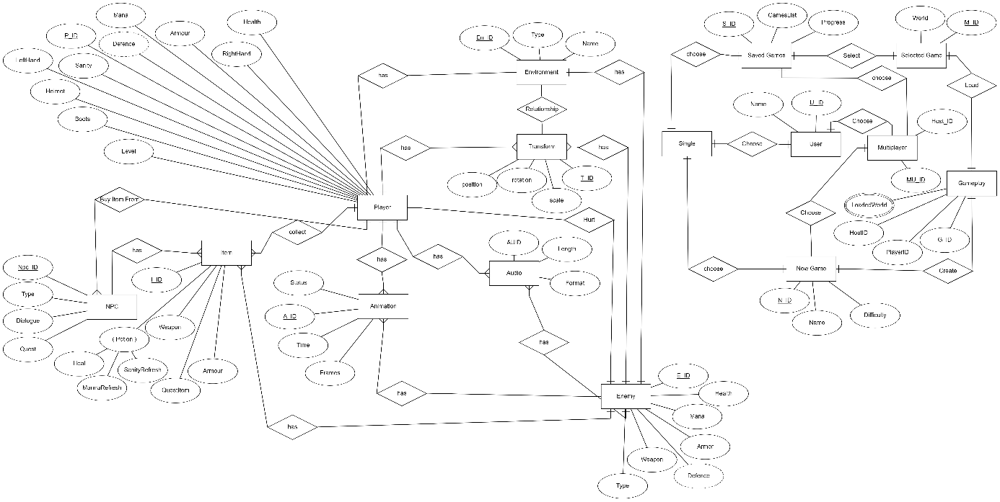
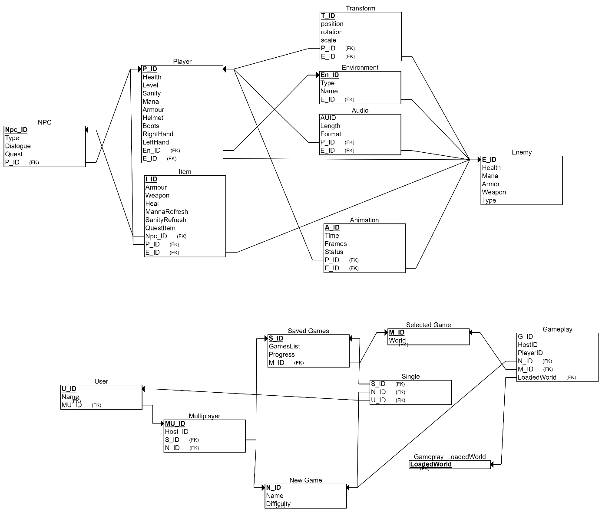

# Adatmodellek

## Adatbázis kezelő kiválasztása

A választott adatbázis-kezelő a _Firebase_.

<!--
A _Firebase_ egy _Google_ által fejlesztett platform, amely széles körű backend-szolgáltatásokat kínál, beleértve az adatbázis-kezelést, autentikációt és valós idejű adatkommunikációt. Két fő adatbázis-megoldást biztosít:

- **Firebase Realtime Database:** Egy NoSQL alapú, valós idejű szinkronizációra optimalizált adatbázis.
- **Cloud Firestore:** Egy modern, skálázható NoSQL adatbázis, amely szintén támogatja a valós idejű adatkommunikációt.

**Firebase kiválasztásának indokai:**

- **Valós idejű szinkronizáció**
  - A _Firebase Realtime Database_ és _Firestore_ natív támogatást nyújt a valós idejű adatszinkronizációhoz, amely kulcsfontosságú a játékosok közötti gyors kommunikáció és az online mentések kezelése során.
  - A kapcsoló szerverek és a játékosok közötti állapotfrissítések azonnal szinkronizálódnak.
- **Skálázhatóság**
  - A _Firebase_ infrastrukturális alapját a _Google Cloud_ biztosítja, amely nagy volumenű terheléseket is képes kezelni. Ez előnyös a játék népszerűsödése esetén, mivel a rendszer automatikusan skálázódik a forgalomnak megfelelően.
  - A _Firestore_ regionális replikációt biztosít, ami alacsony késleltetést eredményez.
- **Egyszerű integráció és gyors fejlesztés**
  - A _Firebase_ SDK-k széles körű támogatást biztosítanak különféle platformokon, beleértve a _Godot_-ot, amelyet a mi játékunk is használ.
  - Az előre elkészített funkciók, például az autentikációs modulok és a valós idejű adatfolyamok, jelentősen csökkentik a fejlesztési időt.
- **Költséghatékonyság**
  - A _Firebase_ ingyenes rétege (_Spark Plan_) lehetőséget biztosít prototípusok és kisebb projektek létrehozására.
  - A skálázódó fizetési struktúra (_Blaze Plan_) lehetővé teszi, hogy csak a ténylegesen használt erőforrások után kelljen fizetni.
- **Biztonság és megbízhatóság**
  - A _Firebase_ biztonsági szabályrendszere testreszabható, így biztosítható, hogy csak a hitelesített játékosok férjenek hozzá az adatokhoz.
  - Az automatikus adatmentés és redundancia minimalizálja az adatvesztés kockázatát.
- Keresztplatformos támogatás
  - A _Firebase_ kiválóan támogatja az _Android_, _iOS_, és webes platformokat, ami megkönnyíti a játék keresztplatformos kompatibilitását.

**Konkrét alkalmazás a játékban:**

- **Online mentések kezelése**
  - A _Firebase Firestore_ használatával minden játékoshoz egyedi mentési slotok rendelhetők a `.knightsage` fájlok tárolásához, amelyek automatikusan frissülnek, amikor változás történik.
- **Kapcsoló szerver funkciók**
  - A szerver valós idejű adatkapcsolatot biztosít a játékosok között, például lobby-információk megosztásával.
  - A szerverek a _Firebase Realtime Database_-en keresztül nyomon követhetik az aktív játékokat, és hostokat rendelhetnek a csatlakozni kívánó játékosokhoz.
- **Felhasználói adatok tárolása**
  - A _Firebase Authentication_ összeköthető az adatbázissal, lehetővé téve a felhasználók egyszerű azonosítását és az adatok személyre szabását.
-->
## Szemantikai adatmodell

## Relációs adatmodell

## Az adatbázis kezelővel kapcsolatot tartó osztályok

### Adatbázis Kezelő Osztályok Áttekintése

**Definíció és Szerep**

Az adatbázis kezelővel kapcsolatot tartó osztályok felelősek az alkalmazás és az adatbázis közötti
kommunikációért. Ez magában foglalja az adatok lekérdezését, módosítását, törlését és beszúrását. Az
ilyen osztályok alapvető szerepe az, hogy biztosítsák az adatbázis műveletek hatékony és biztonságos
végrehajtását.

**Funkciók és Feladatok**

- **Kapcsolat létrehozása és kezelése:** Az adatbázis kapcsolat létrehozása, hitelesítési adatok kezelése, kapcsolat bontása, és a kapcsolat állapotának figyelése.
- **SQL lekérdezések végrehajtása:** SQL lekérdezések összeállítása, előkészítése és futtatása, valamint az eredményhalmaz kezelése.
- **Tranzakciók kezelése:** Tranzakciók indítása, elkötelezése és visszagörgetése.

### Osztályok Kialakítása és Felépítése

**Adatbázis Kapcsolat Osztály (Connection Class)**

- **Felelőssége, feladata:** Az adatbázis kapcsolat osztály felelős az adatbázishoz való csatlakozásért. Ez magában foglalja a kapcsolat létrehozását, a bejelentkezési adatok kezelését, a kapcsolat bontását és a kapcsolat állapotának figyelését.

- **Együttműködők:**
  - **ImportGame:** Adatimportáláshoz.
  - **LocalCloudSavedGameList:** Mentett játékok listájának kezeléséhez.
  - **Continue:** Mentett játék betöltéséhez.
  - **New Game:** Új játék létrehozásához.

**Attribútumok:**

<table>
    <thead>
        <tr>
            <th>Név</th>
            <th>Típus</th>
            <th>Leírás</th>
        </tr>
    </thead>
    <tbody>
        <tr>
            <td>`databaseURL`</td>
            <td>`String`</td>
            <td>Az adatbázis elérési útja</td>
        </tr>
        <tr>
            <td>`username`</td>
            <td>`String`</td>
            <td>A felhasználónév</td>
        </tr>
        <tr>
            <td>`password`</td>
            <td>`String`</td>
            <td>A jelszó</td>
        </tr>
        <tr>
            <td>`connection`</td>
            <td>`Connection`</td>
            <td>Az adatbázis kapcsolat objektuma</td>
        </tr>
    </tbody>
</table>

**Operációk:**

<table>
    <thead>
        <tr>
            <th>Név</th>
            <th>Argumentumok</th>
            <th>Működése, feladata</th>
        </tr>
    </thead>
    <tbody>
        <tr>
            <td>`connect()`</td>
            <td>Nincs</td>
            <td>Létrehozza az adatbázis kapcsolatot</td>
        </tr>
        <tr>
            <td>`disconnect()`</td>
            <td>Nincs</td>
            <td>Bontja az adatbázis kapcsolatot</td>
        </tr>
        <tr>
            <td>`isConnected()`</td>
            <td>Nincs</td>
            <td>Ellenőrzi, hogy az adatbázis kapcsolat aktív-e</td>
        </tr>
    </tbody>
</table>

**Lekérdezés Kezelő Osztály (Query Handler Class)**

- **Felelőssége, feladata:** Az SQL lekérdezés kezelő osztály felelős az SQL lekérdezések összeállításáért és végrehajtásáért.
- **Együttműködők:**
  - **SaveSystem:** Az adatbázis kapcsolat osztály segítségével végrehajtott lekérdezésekhez.
  - **Continue:** Az SQL lekérdezések eredményének feldolgozásához.

**Attribútumok:**

<table>
    <thead>
        <tr>
            <th>Név</th>
            <th>Típus</th>
            <th>Leírás</th>
        </tr>
    </thead>
    <tbody>
        <tr>
            <td>`sqlQuery`</td>
            <td>`String`</td>
            <td>Az SQL lekérdezés szövege</td>
        </tr>
        <tr>
            <td>`resultSet`</td>
            <td>`ResultSet`</td>
            <td>Az SQL lekérdezés eredményhalmaza</td>
        </tr>
    </tbody>
</table>

**Operációk:**

<table>
    <thead>
        <tr>
            <th>Név</th>
            <th>Argumentumok</th>
            <th>Működése, feladata</th>
        </tr>
    </thead>
    <tbody>
        <tr>
            <td>`executeQuery()`</td>
            <td>`String query`</td>
            <td>Végrehajt egy SQL lekérdezést</td>
        </tr>
        <tr>
            <td>`executeUpdate()`</td>
            <td>`String query`</td>
            <td>Végrehajt egy SQL módosító lekérdezést</td>
        </tr>
        <tr>
            <td>`prepareStatement()`</td>
            <td>`String query`</td>
            <td>Előkészít egy SQL lekérdezést</td>
        </tr>
    </tbody>
</table>

**Adatbázis Tranzakció Kezelő Osztály (Transaction Manager Class)**

- **Felelőssége, feladata:** Az adatbázis tranzakció kezelő osztály felelős az adatbázis tranzakciók kezeléséért (BEGIN, COMMIT, ROLLBACK).
- **Együttműködők:**
  - **SaveSystem:** A tranzakciók indításához és kezeléséhez.
  - **LocalCloudSavedGameList:** Tranzakciók kezeléséhez a mentett játékok szinkronizálása során.

**Operációk:**

<table>
    <thead>
        <tr>
            <th>Név</th>
            <th>Argumentumok</th>
            <th>Működése, feladata</th>
        </tr>
    </thead>
    <tbody>
        <tr>
            <td>`beginTransaction()`</td>
            <td>Nincs</td>
            <td>Elindít egy tranzakciót</td>
        </tr>
        <tr>
            <td>`commit()`</td>
            <td>Nincs</td>
            <td>Elkötelezi a tranzakciót</td>
        </tr>
        <tr>
            <td>`rollback()`</td>
            <td>Nincs</td>
            <td>Visszagörgeti a tranzakciót</td>
        </tr>
    </tbody>
</table>

### Tervezési Minták és Legjobb Gyakorlatok

**DAO (Data Access Object) Minta**

A DAO minta segít az adatbázis műveletek absztrakciójában és elkülönítésében az üzleti logikától. Az
adatbázis műveletek külön osztályokba szervezése tisztább és karbantarthatóbb kódot eredményez.

**Repository Minta**

A repository minta az adatelérés centralizálására szolgál, megkönnyítve ezzel a tesztelhetőséget és az
adatelérési logika újrafelhasználhatóságát.

**Singleton Minta**

A Singleton minta biztosítja, hogy egy osztályból csak egy példány létezik. Az adatbázis kapcsolat
osztály esetében a Singleton minta használata garantálja, hogy mindig ugyanazt a kapcsolatot
használjuk az alkalmazásban.

### Hibakezelés és Biztonság

**Hibakezelés**

Az adatbázis műveletek során fellépő hibák kezelése try-catch blokkok használatával történik. A hibák
loggolása is fontos a későbbi hibaelhárítás és nyomon követés érdekében.

**Biztonsági Szempontok**

Az adatbázis kapcsolatok biztonságos kezelése magában foglalja a jelszavak titkosítását, az SQL
injekció megelőzését előkészített állítások használatával és a szerepkör-alapú hozzáférés
szabályozását.
